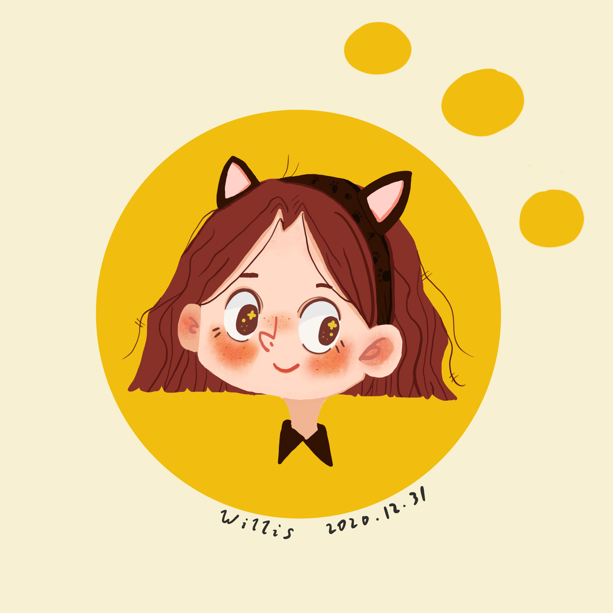

Procreateをダウンロードしたとき、使用方法が理解しにくかったです。何かを描こうと試みましたが、あまり上手く行けませんでした。最後に、ある[チュートリアルビデオ](https://www.bilibili.com/video/BV1zE411C7Py?share_source=copy_web&vd_source=1920fa7f9c47f2879b82846fb2c6f3ba)が見つけたので、それに従ってイラストを描くようにしました。これが私の最終的な作品です。

