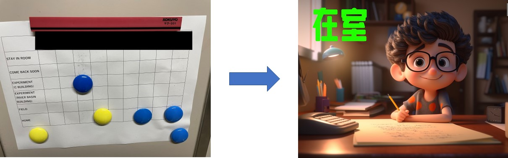
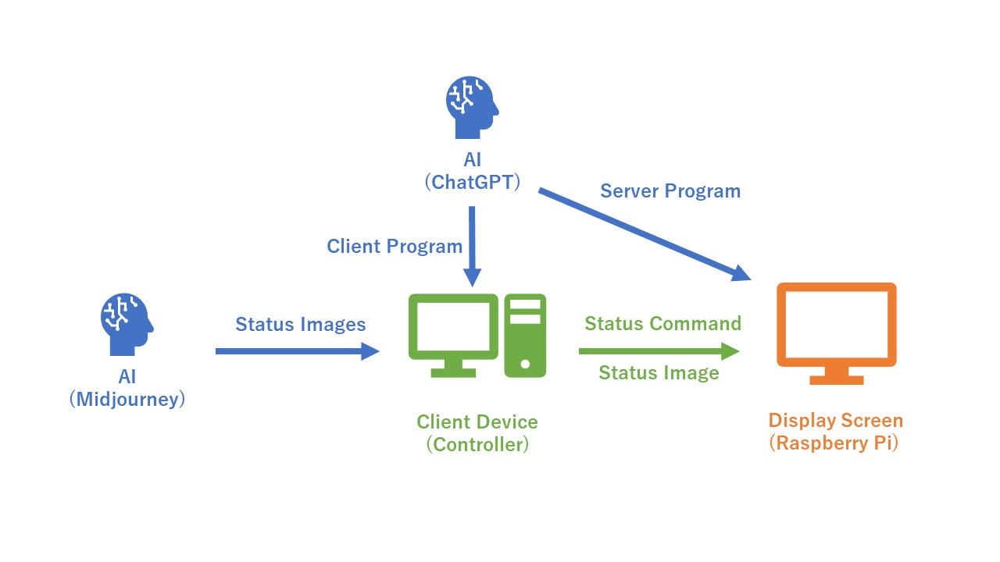

# Overview
---

The product developed in this project is an experimental version that upgrades traditional paper office door signs 
using the latest AI technology. It mainly consists of a display screen, Raspberry Pi, control terminal devices, and a display stand.
The main principle involves transmitting image content from the control terminal program to the Raspberry Pi 
for display on the screen. In this project, AI technology is primarily used for image generation (Midjourney)
and coding assistance (ChatGPT).

# Project Background and Objectives
---

Traditional paper office door signs have limited states they can display, and their content is not easily expandable. 
For instance, if a new member joins a room or if a member needs to display more states, 
it's necessary to redesign and remake the sign. The content that each sign can display is also somewhat limited 
by the size of the paper. Additionally, if a member's status changes without returning to the room 
(such as going home directly from outside the campus), the status on the paper sign on the door cannot be updated in real time. 
An electronic version of the sign, which can be updated online, can solve all these issues.

# Product Features
---

・Customizable: As it is no longer limited to paper media, members can freely customize the status they want to display
along with the image content representing that status, theoretically without any limit on quantity.  

・Remotely Controllable: Since there is no need to directly control the display screen's control unit (Raspberry Pi), 
members can modify their status from outside.  

・More Visual Representation: Compared to cold text and magnets on a grid, 
cartoon representations of members and the states they represent can more vividly and intuitively display their status.

<i>(Some of the above features have not yet been perfectly implemented at this stage.)</i>

# Technical Principles
---

Initially, Midjourney generates status images based on member requirements and stores them on the client device. 
Then, the client program sends the selected status and its corresponding image to the server device (Raspberry Pi). 
This way, the display connected to the server device shows the status chosen by the member. ChatGPT plays a role in writing both the client-side and server-side programs.

# Related Blog Posts
---

[Making a Digital Office Door Sign Based on AI Application (Part 1)](https://weils302.com/en/techblog/status_list_1_20230407/)  
[Making a Digital Office Door Sign Based on AI Application (Part 2)](https://weils302.com/en/techblog/status_list_2_20230415/)  
[Making a Digital Office Door Sign Based on AI Application (Part 3)](https://weils302.com/en/techblog/status_list_3_20230418/)

# Update Log
---
[Digital Office Door Sign Update Log](https://weils302.com/en/techblog/status_list_update/) 
