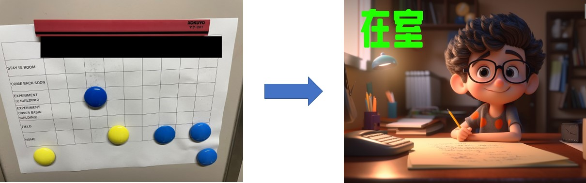
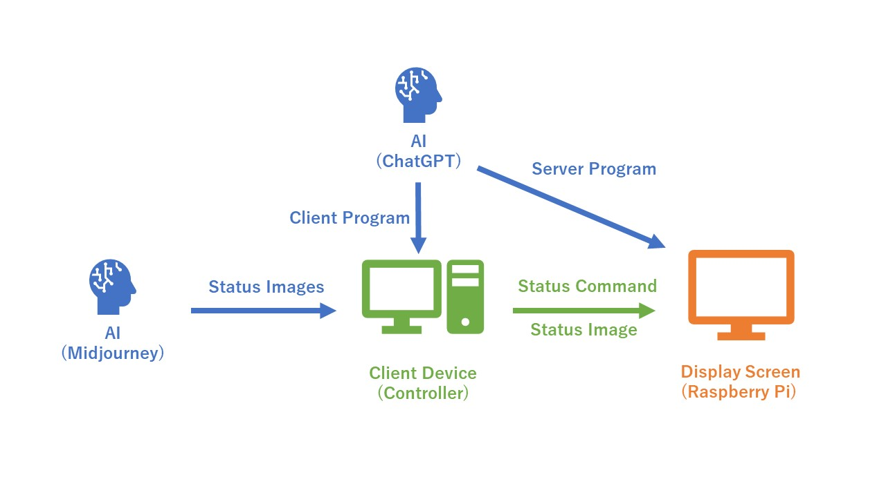

# 概要
---

このプロジェクトで開発された製品は、最新のAI技術を使用して伝統的な紙の在室表をアップグレードする実験的なバージョンです。
主にディスプレイスクリーン、ラズベリーパイ、制御端末装置、およびディスプレイスタンドから構成されています。
主な原理は、制御端末プログラムからラズベリーパイに画像コンテンツを送信し、スクリーンに表示することです。このプロジェクトでは、
AI技術が主に画像生成（Midjourney）およびコーディング支援（ChatGPT）のために使用されています。

# プロジェクトの背景と目標
---

伝統的な紙の在室表は表示できる状態が限られており、内容の拡張性も低いです。例えば、ある部屋に新しいメンバーが加わったり、
メンバーがより多くの状態を表示する必要がある場合、表を再設計して作り直す必要があります。各在室表が表示できる内容も、紙のサイズによってある程度制限されます。
さらに、部屋に戻らずにメンバーの状態が変更された場合（例えば、学外から直接帰宅するなど）、ドアの在室表の状態はリアルタイムで更新されません。
これらの問題は、オンラインで状態を更新できる電子在室表で解決できます。

# 製品の特徴
---

・カスタマイズ可能：紙媒体に制限されなくなったため、メンバーは自由に表示したい状態とその状態を表す画像コンテンツをカスタマイズできます。
理論的には量に制限がありません。  

・リモートコントロール可能：ディスプレイの制御ユニット（ラズベリーパイ）を直接操作する必要がないため、メンバーは外出先から直接状態を変更できます。  

・より視覚的な表現：冷たいテキストやグリッド上のマグネットと比較して、メンバーのカートゥーン表現とそれが示す状態は、
メンバーの状態をより生き生きと直感的に表示できます。

<i>(上記の機能の一部は、現段階ではまだ完璧に実装されていません。)</i>

# 技術原理
---

まず、Midjourneyがメンバーの要求に基づいて状態画像を生成し、クライアントデバイスに保存します。次に、クライアントプログラムがメンバーが
選択した状態とそれに対応する画像をサーバーデバイス（ラズベリーパイ）に送信します。
これにより、サーバーデバイスに接続されたディスプレイにメンバーが選択した状態が表示されます。ChatGPTはクライアント側とサーバー側のプログラムの作成において役割を果たしています。

# 関連するブログ投稿
---

[AIアプリケーションに基づいた電子在室表の作成 (1)](https://weils302.com/techblog/status_list_1_20230407/)  
[AIアプリケーションに基づいた電子在室表の作成 (2)](https://weils302.com/techblog/status_list_2_20230415/)  
[AIアプリケーションに基づいた電子在室表の作成 (3)](https://weils302.com/techblog/status_list_3_20230418/)

# 更新ログ
---
[電子在室表更新ログ](https://weils302.com/techblog/status_list_update/) 

