# Introduction
---
<div style="text-align: justify;">
Ever since I bought my own car I've been driving Kei cars that are over ten years old.
The one I'm currently driving has even clocked 160,000 kilometers.While these Kei cars are convenient for routine tasks 
like grocery shopping and are cost-effective to maintain, they undoubtedly have drawbacks like insufficient power, 
limited space, and not being suitable for long journeys. Now that I've started earning my own money, 
I'm considering switching to a regular vehicle with a standard license plate.Out of all the cars I've driven, 
the BMW 3 series has been the most comfortable and stable, so I'm contemplating purchasing one this time around. 
I have a certain level of experience with used car transactions and have my own thoughts on how to find a 
satisfactory yet affordable car. However, having recently learned about data science, I thought I'd take 
this opportunity to apply my newfound knowledge to analyze the factors affecting car prices, their degree of influence, 
and if this could assist me in making wise decisions when choosing a car in the future.
</div>

# Code for Web Content Extraction
---
<div style="text-align: justify;">
On CarSensor's homepage (a famous Japanese used car information website), after selecting a car model, 
the results are displayed in a paginated list format. Each result has a corresponding link to access 
detailed information for each car. As the BMW 3 series is my target model, all the search results pertain to the 3 series.
</div>

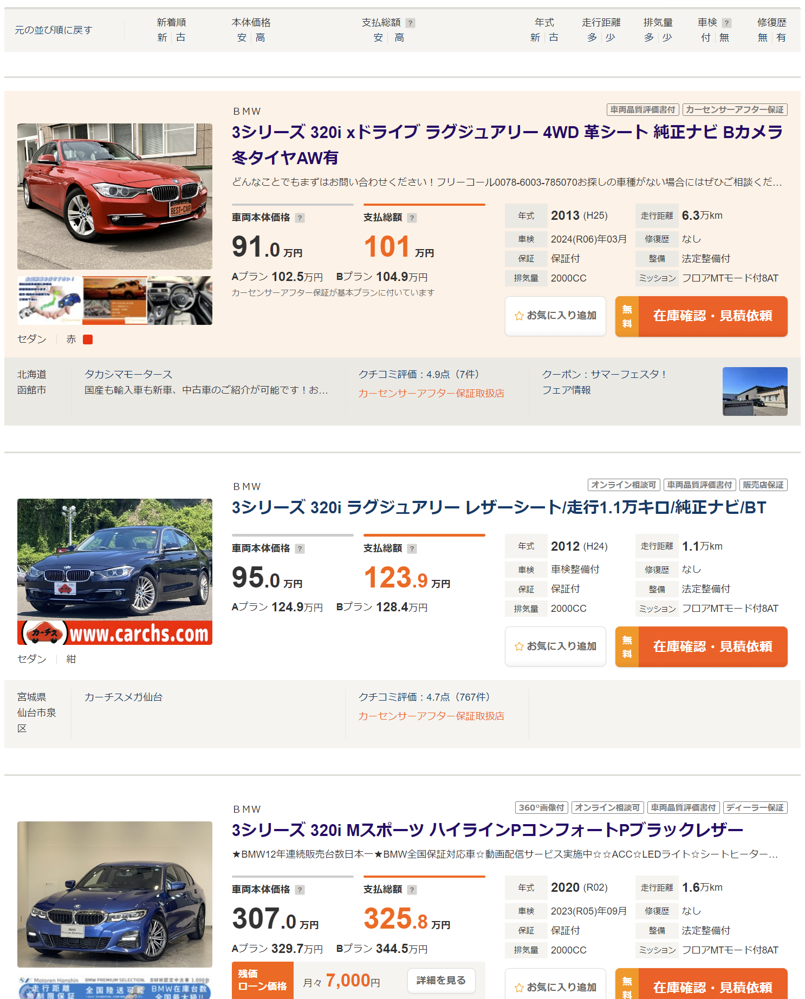
<p style="font-size: 16px; line-height: 0.6;"><i>(This is how the results are displayed)</i></p>

<div style="text-align: justify;">

Here's the step-by-step process I conceived to extract detailed car information:  
***1.*** Input the link to the search results page in the code and execute it.  
***2.*** The code first determines the total number of result pages, which will then help in defining the number of loops and iterating over each results page.  
***3.*** For each results page, the code will traverse every car's detail page, extract the car information, and save it to a CSV file.  


Since the car information can be extracted from the HTML, I used BeautifulSoup for the scraping.  
</div>

### Basic Vehicle Information Extraction
---
<div style="text-align: justify;">

At the top of the details page, there's a table as illustrated below, from which we can extract the basic
information of the vehicle. Based on my previous experience, this information is basically what has the most impact on the price of the car.

</div>

 

<div style="text-align: justify;">

Each piece of information in the table has its associated path, so using BeautifulSoup's CSS selector makes extraction feasible. 
Strings such as the era written in the Japanese calendar mentioned in parentheses after the model year and the "万km" after the mileage
might be cumbersome to deal with in subsequent data analyses.
Thus, I intend to handle these details during the extraction phase. The specific treatments are as follows:  


***Price:*** The base price is directly stored as a numeral in the CSS. All that's needed is to remove the commas to turn it into a numeric type.
The standard format for the total price is either "numeral+万円" or just "--- 万円."
In this case, remove "万円" and store the numeral after multiplying it by 10000. Any entry without a stated total price is set to 0.

</div>

```python
if key == 'base_price':
  data[key] = element.get('content').replace(",", "")  # remove comma from the number
elif key == 'total_price':
  price_text = element.text.strip()  # remove leading/trailing whitespaces
    if price_text == "---万円":
      data[key] = "0"
    else:
      # remove '万円' and convert to the required format
      price_text = price_text.replace('万円', '')
      price_float = float(price_text) * 10000  # convert '万' to actual number
      data[key] = str(int(price_float))  # convert it to string without comma
```

<div style="text-align: justify;">

***Mileage:*** This is similar to the price, just need to remove the extra strings at the end and convert the unit.
</div>

```python
elif key == 'distance':
    distance_float = float(element.text) * 10000
    data[key] = str(int(distance_float))
```
<div style="text-align: justify;">

***Vehicle Inspection:*** The way vehicle inspections are presented on the website is slightly complex. 
Some entries only state "with inspection" or "without inspection," while others are formatted as "YYYY (Japanese calendar YY) MM."
I believe what affects the vehicle's price is the remaining duration of the vehicle inspection. So, I plan to store the information on the remaining months.
First, determine if it's "with inspection" or "without inspection" and record as 24 and 0 respectively. For other content,
extract just the year and month numbers and compute the remaining duration based on the current date.

</div>

```python
elif key == 'inspection_remaining_month':
    inspection_elements = element.select('p')
    if len(inspection_elements) >= 2:
        inspection_text = inspection_elements[1].text
        if inspection_text == "車検整備付":
            data[key] = "24"
        elif inspection_text == "車検整備無":
            data[key] = "0"
        elif len(inspection_elements) >= 3:
            year_month_text = inspection_elements[1].text + inspection_elements[2].text
            # Use a regular expression to extract the year and month
            match = re.match(r'(\d{4})\(R\d{2}\)年(\d{1,2})月', year_month_text)
            if match:
                year = int(match.group(1))
                month = int(match.group(2))
                # Calculate the difference in months
                now = datetime.datetime.now()
                diff = (year - now.year) * 12 + month - now.month
                data[key] = str(diff)
            else:
                data[key] = year_month_text
    else:
        data[key] = None
```
<div style="text-align: justify;">

***Repair History:*** Since there are only two types - repaired or not repaired - it's stored directly as 1 and 0.
</div>

```python
elif key == 'repair':
    if element.text == 'なし':
        data[key] = 0
    elif element.text == 'あり':
        data[key] = 1
    else:
        data[key] = element.text
```
<div style="text-align: justify;">

***Region:*** I'm not sure about the extent to which the region affects the price. However, I've heard before that in regions
like Hokkaido, where there's abundant snow, the vehicle undercarriage tends to rust, making the cars cheaper. 
Hence, I'd like to verify this practically this time. The location data is formatted as "Prefecture + City/Town/Village." 
Since not all sellers specify the "City/Town/Village," I plan to categorize the location into two columns: "Prefecture" and "City."
</div>

```python
elif key == 'region':
    # Split the text by the <br/> tag and save each part to the corresponding column.
    region_parts = element.decode_contents().split('<br/>')
    data['Prefecture'] = region_parts[0].strip() if len(region_parts) > 0 else None
    data['City'] = region_parts[1].strip() if len(region_parts) > 1 else None
```

### Vehicle Condition Information Extraction
---
<div style="text-align: justify;">
Next is the table describing the vehicle's condition.
</div>

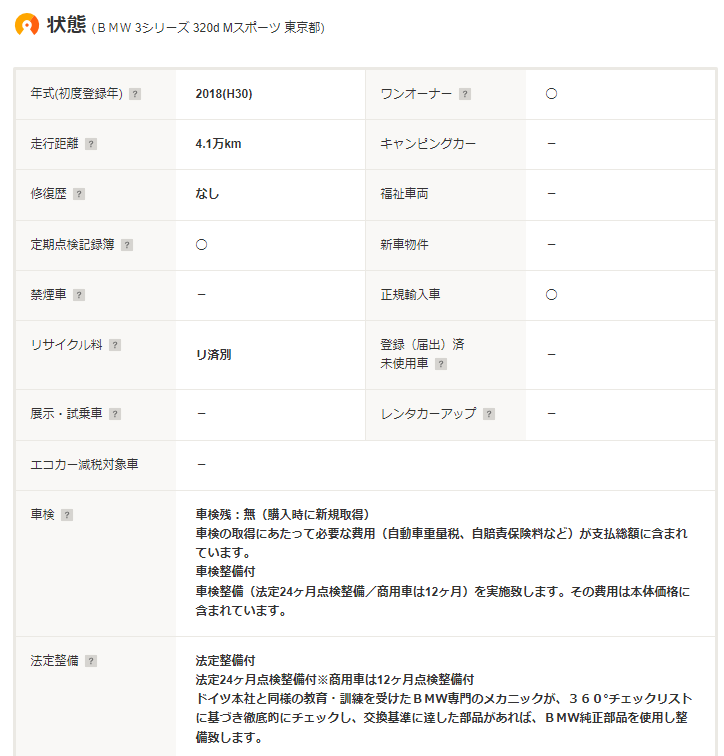
<div style="text-align: justify;">
Most of the content in this table is represented by "◯" and "ー," so, similar to the previous repair history, 
I'll use 1 and 0. Furthermore, since the format of the strings is predetermined, I can determine the string content and 
save the corresponding information.
</div>

```python
elif key in ['one_owner', 'record_book', 'new_car', 'no_smoke', 'registered', 'legally_imported',
             'demo_car', 'rental_car', 'eco_car', 'camping', 'welfare']:
    # If the text is '◯', store 1, otherwise store 0.
    data[key] = '1' if element.text.strip() == '◯' else '0'
```

<div style="text-align: justify;">
Below the table, there's content about warranties (which wasn't shown in the image). The basic information is whether 
there's a warranty and the type of warranty. I've separated these details into two columns for storage (I used the word "guarantee" in my code).
</div>

```python
elif key == 'legal_maintenance':
    # Check if the text is "法定整備付", "法定整備無", or "法定整備別" and store 1, 0, or 2 accordingly.
    text = element.text.strip()
    if '法定整備付' in text:
        data[key] = '1'
    elif '法定整備無' in text:
        data[key] = '0'
    elif '法定整備別' in text:
        data[key] = '2'
    else:
        data[key] = None
elif key == 'guarantee':
    # Check if the text contains "保証付" or "保証無", and "ディーラー保証" or "販売店保証".
    text = element.text.strip()
    if '保証付' in text:
        data['guarantee_exists'] = '1'
        if 'ディーラー保証' in text:
            data['guarantee_type'] = '1'
        elif '販売店保証' in text:
            data['guarantee_type'] = '0'
    elif '保証無' in text:
        data['guarantee_exists'] = '0'
        data['guarantee_type'] = None
```

### Specifications and Equipment Information Extraction
---
<div style="text-align: justify;">
The content in the specifications section is relatively complex, so I've saved most of the original strings directly to the CSV. Later, I considered using LabelEncoder to analyze this section.

For equipment details, I can generally use 0 and 1 for storage. If there's a subdivision within a particular equipment, 
I use the format "EquipmentName_SubdivisionEquipment" as the column name and store the data as 0 and 1. 
This portion of the code is quite long, so I've omitted it.
</div>

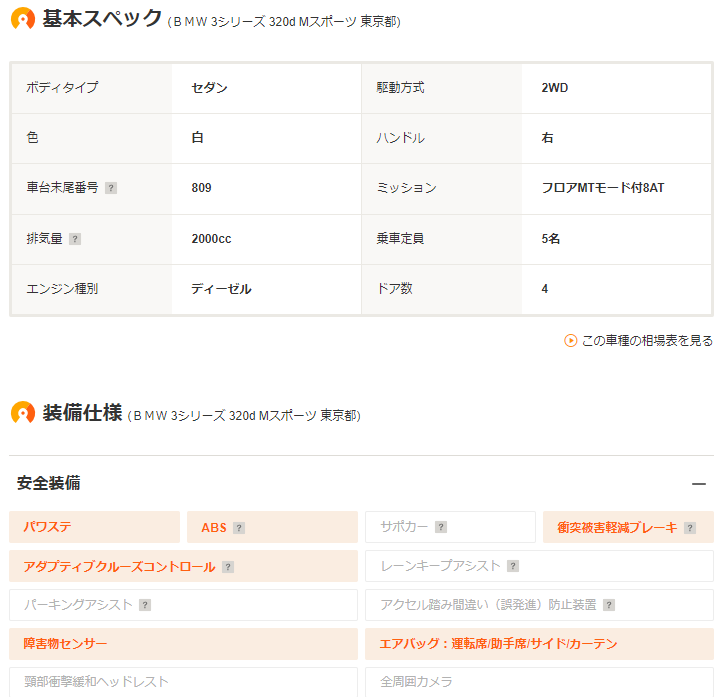

# Automated Extraction of Vehicle Information
---
<div style="text-align: justify;">
Following the above logic, after several trial and error attempts, I finally penned down the final code.
</div>

[(code link)](https://github.com/weils302/car_sensor_data_alnalysis/blob/main/car_scraper.py)
<div style="text-align: justify;">
The next step is the actual execution. I began the process on August 1st, 2023, at 10:30 pm. At that time, 
there were 1,452 vehicles listed on the search page. The data I analyzed later was based on this timestamp.
</div>


<p style="font-size: 16px; line-height: 0.6;"><i>(At that moment, the total count was 1,452)</i></p>
<div style="text-align: justify;">
After approximately 30 minutes of running, the program successfully scraped all vehicle information and generated a CSV file.
</div>


<p style="font-size: 16px; line-height: 0.6;"><i>(The code execution result shows successful extraction of information for 1,452 vehicles.)</i></p>

# Data Analysis
---
### Data Cleaning
---
<div style="text-align: justify;">
To check if the csv file was saved properly, I first opened the file in Excel, which resulted in a bunch of gibberish as well as missing data.
</div>

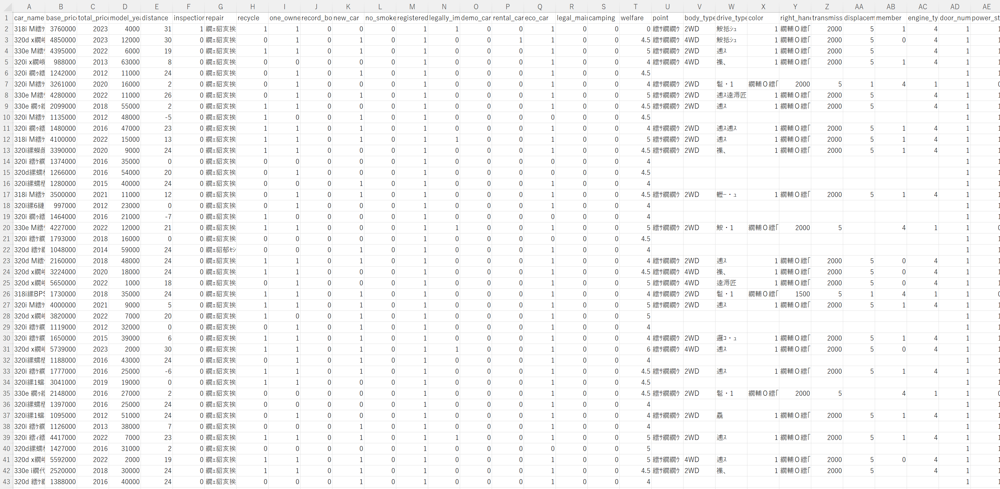

<div style="text-align: justify;">
Given that there are often character encoding issues with Japanese web pages and operating systems, I wasn't overly concerned.
I began by investigating potential character encoding problems. Since the web page used utf-8 encoding and my csv file was also saved in utf-8,
it's highly probable that the issue arose when Excel, on a Japanese OS, failed to apply the right character encoding.
The only time I encountered an encoding problem using BeautifulSoup was due to cp932. Also, my instructor suggested me try using cp932.
Thus, I promptly wrote a snippet of code to resave the file using cp932 encoding. I encountered an error related to "\xa0",
which, upon research, turned out to be a type of whitespace. By replacing all "\xa0" characters with regular spaces,
I finally got a csv file that Excel could read without issues. The next step was to upload the data to Google Colab for further processing.
</div>

```python
import pandas as pd

df = pd.read_csv('data.csv', encoding='utf-8')

# Replace non-breaking spaces in the DataFrame with regular spaces
df = df.replace('\xa0', ' ', regex=True)
df.to_csv('car_price.csv', encoding='cp932', index=False)

```


In Colab, I began by loading the data using Pandas. Using the ```info()``` method to view data details, I confirmed that 1,452 rows and 106 columns had been successfully loaded.


<div style="text-align: justify;">
Given that the data pertained to only one car model, some features (like seat count, presence of a sliding door, etc.) exhibited unique values.
These features offered no analytical value and were discarded right off the bat. After filtering, I found attributes such as
"new_car", "registered", "camping", "welfare", "member", "backseat_monitor", "bench_seat", "3rd_row", "walk_through",
"roof_rail", "lift_up", and "slide_door" had only singular values. I therefore deleted these columns.
</div>

<div style="text-align: justify;">
After that, I found some columns with no data at all or with obvious missing data, as well as links to web pages
that are not needed in the analysis, and these need to be deleted from the whole column. For example, in the image below,
"City" is one of the columns with obvious missing data. The "guarantee_type" is also obviously missing,
but I have not deleted it for the time being as I am considering that I may need it for the next analysis.
</div>


<div style="text-align: justify;">
For those elements with only a few rows of missing data, it is not necessary to delete the entire column,
but only the corresponding rows, such as "inspection_remaining_month" and "right_handle" in the following image.
</div>


<div style="text-align: justify;">
After processing the final data left 87 columns and 1432 rows, except for "guarantee_type" there is no missing data, that can be analyzed.
</div>


<div style="text-align: justify;">
Just in case, I also looked at the data using the "describe()" method, and found that there are still problems.
The max values for "base_price" and "distance" were not normal. I opened the page corresponding to the price outliers.
After checking the page, I found that the price labeled as "応談" by the merchant is written as 9999999999 in the CSS,
and the distance is abnormal because the unit of distance on the page is not "万km", therefore the code automatically multiplies it by 10,000 resulting in an incorrect value.
So I changed the price of 9999999999 to 0, and divided the distance greater than 300000 by 10000, and finally the data became normal.
</div>

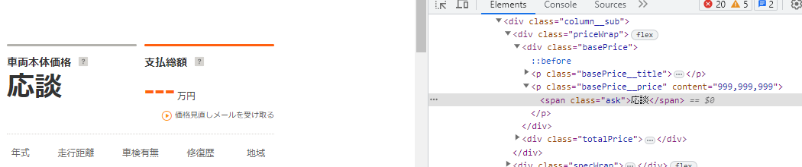


### Data Visualization and Analysis
---
#### ・Relationship between Vehicle Model Year and Price
<div style="text-align: justify;">
One of the major factors influencing price is the model year of the vehicle. I started my analysis with this aspect. 
Initially, I tried plotting the data on a scatter plot, which indicated that newer cars tend to be more expensive, 
but not much else could be discerned. Hence, I switched to a box plot for a clearer perspective.
</div>

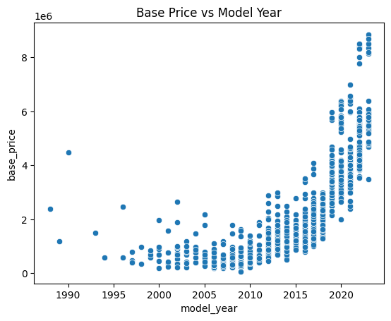

<div style="text-align: justify;">
From the box plot, it's evident that there are significant price disparities between the years 1996 and 1997, 2011 and 2012,
and 2018 and 2019. To eliminate biases arising from smaller sample sizes for certain years, I checked the number of vehicles available for each year.
</div>

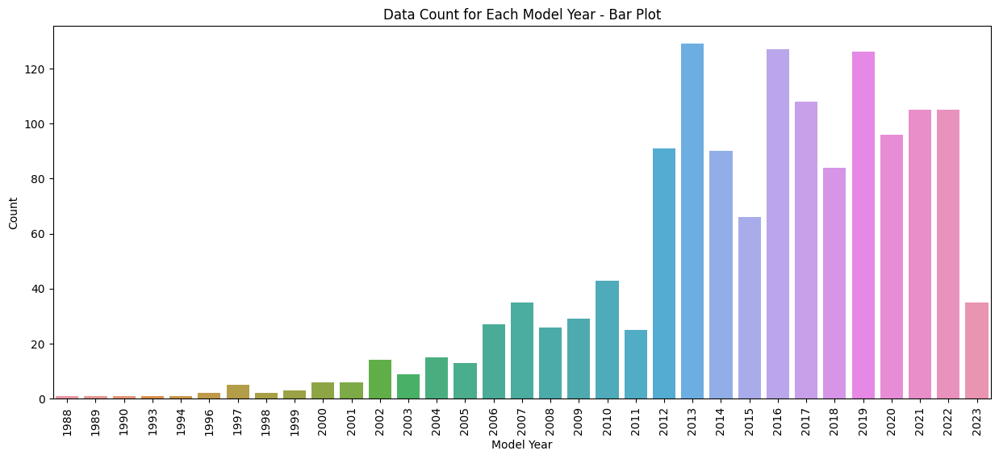
<div style="text-align: justify;">
It's noticeable that the number of cars from before 2012 is relatively low, especially those before 2006. 
Thus, the price difference between 1996 and 1997 likely arises from individual variances. However, 
the pronounced gap between 2011 and 2012, both in terms of price and quantity, I believe, can be attributed to a model change. 
In 2012, the 3 Series transitioned from the E90 to the F30 model. While there isn't a significant count difference 
between 2018 and 2019, the price disparity is even more pronounced than between 2011 and 2012. Cars from 2019 onwards 
belong to the current G20 model series, which is naturally pricier.

I plotted a KDE curve for the aforementioned years with noticeable price differences, and it's evident that the peak prices
between 2012, 2018, and 2019 vary significantly, with a difference of over a million yen.
This corroborates my earlier observation: the current model is the priciest, the previous generation is slightly cheaper,
and the older models are the least expensive, albeit with minimal differences.
</div>


#### ・Relationship between Mileage and Price
<div style="text-align: justify;">
From past observations, cars with higher mileage are generally cheaper. However, the extent of this influence wasn't immediately clear to me. 
Thus, I started with a scatter plot, where the red line represents the regression line. It's clear from the plot that cars with more mileage tend to be less expensive.
</div>

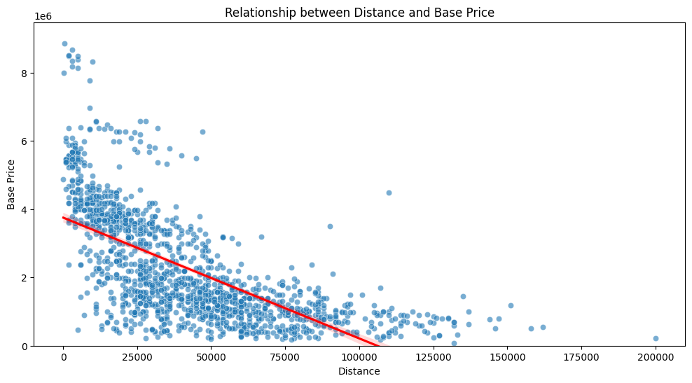
<div style="text-align: justify;">
Taking into account that older cars are more likely to have higher mileage, I regrouped the scatter plot based on 
the model change years discussed earlier. Firstly, it's clear that there are significant price differences among 
the three groups. Secondly, the regression line suggests that for older cars, mileage doesn't influence the price 
as significantly as it does for the current model and its predecessor. For the latest model, 
since there aren't many cars with high mileage, the regression line for the higher mileage segment isn't as accurate as 
it is for the previous generation.
</div>


#### ・Relationship Between Repair History and Price
<div style="text-align: justify;">
Repair history is also a significant factor affecting the price of a vehicle. 
I had always assumed that the money spent on buying a previous generation model could purchase a next-generation model 
with a repaired history. Initially, I used a box plot to compare the prices between cars with and without repaired history.
It is evident that cars with a repaired history are noticeably cheaper than those without.
</div>

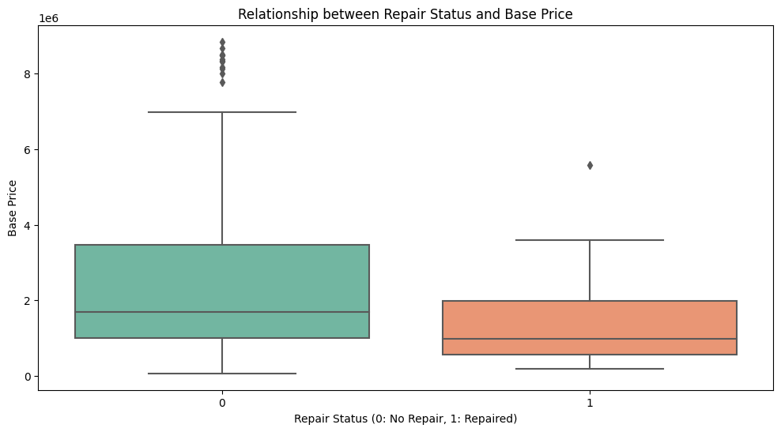
<div style="text-align: justify;">
Subsequently, I used the same grouping method as before. It can be observed that, similar to mileage, 
there does not seem to be a significant price difference for cars before 2012 based on their repair history. 
However, for cars after 2012, those with a repaired history are significantly cheaper. Yet, for cars after 2019, 
the price range for those repaired is quite large, so it cannot be definitively stated that repaired cars are always cheaper.
</div>


#### ・Relationship Between Remaining Vehicle Inspection and Price
<div style="text-align: justify;">
I first used a scatter plot to look at the relationship between the remaining valid vehicle inspection months and 
the vehicle’s base price. It appears that although more vehicle inspection correlates with a higher price, 
the impact does not seem to be significant.
</div>

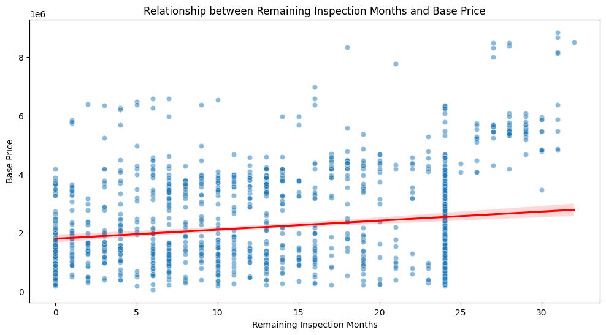
<div style="text-align: justify;">
Later, I realized that vehicle inspection is sometimes not included in the vehicle's base price. 
For some cars with "vehicle inspection included," some dealers add the inspection cost to the "miscellaneous expenses," 
which is included in the total price. So, I analyzed the total price, and the results are similar to the base price. 
For a more visual comparison, I calculated the Pearson correlation coefficient between vehicle inspection and 
both types of prices: the base price is 0.1798, and the total price is 0.2076. 
Indeed, vehicle inspection has a greater impact on the total price, but overall, the effect is not substantial.
</div>


#### ・Relationship Between Region and Price
<div style="text-align: justify;">
Initially, I had no clear idea for this analysis, so I casually took the data of prices and regions (prefectures)
to make a box plot. From the median, it can be observed that Kochi Prefecture, Tokushima Prefecture, Aomori Prefecture,
and Wakayama Prefecture are in the highest and lowest positions. However, nothing else could be discerned from this graph,
so I considered incorporating other factors.
</div>


<div style="text-align: justify;">
As the previous conclusion indicated a significant impact of model change on the price, 
I grouped the car prices in each prefecture by the model change years and made a box plot. 
Now it can be seen that the four prefectures mentioned above basically either sell only the newest models at high prices
or only old models at low prices. Like Kochi Prefecture, which primarily has the latest models, 
and their prices are higher than in other prefectures. On the other hand, Aomori Prefecture only has the oldest cars, 
and the prices are very cheap.
</div>


<div style="text-align: justify;">
To grasp the overall price in each prefecture, I made a bar graph of the average prices by region.
It can be seen that there is a price difference between regions, but the main influence is still the age and quantity
of the vehicles sold in that prefecture.
</div>


---
##### (Aside about Region)
<div style="text-align: justify;">
Since I mentioned the snow in Hokkaido before, I was curious about whether it’s better to buy a 4WD car in Hokkaido.
So I visualized the number of vehicles in each prefecture, as well as the number of 2WD and 4WD separately.
It can be seen that Hokkaido does not have a small number of cars for sale, and indeed,
it is the only area where the number of 4WD is more than 2WD. This time, due to time constraints,
I did not continue to analyze the relationship between the drive method and price. 
This point can indeed be further explored in the future.
</div>


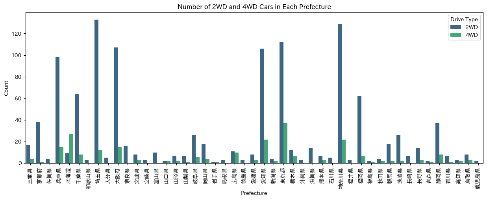
---

#### ・Analysis of the Impact of All Factors on Price
<div style="text-align: justify;">
After analyzing several factors that I believe have a significant impact on price, 
I ranked all the factors based on their degree of impact. The code is as follows:
</div>

```python
# Set the target variable
y = df['base_price']

# Select the features to consider and exclude explicitly mentioned columns
features_to_consider_final = [
    col for col in df.columns.tolist()
    if col not in ['car_name', 'total_price', 'guarantee_type', 'base_price', 'year_group']
]

X_final = df[features_to_consider_final].copy()

# Identify categorical features in the dataset
categorical_features_final = [col for col in features_to_consider_final if df[col].dtype == 'object']

# Initialize the scaler and label encoder
scaler = StandardScaler()
le = LabelEncoder()

# Standardize 'distance' and 'model_year'
X_final[['distance', 'model_year']] = scaler.fit_transform(X_final[['distance', 'model_year']])

# Convert categorical features using LabelEncoder
for col in categorical_features_final:
    X_final[col] = le.fit_transform(X_final[col])

# Train the model using Random Forest
random_forest_regressor_final = RandomForestRegressor()
random_forest_regressor_final.fit(X_final, y)

# Get and sort feature importances
feature_importances_final = random_forest_regressor_final.feature_importances_
feature_importances_final_df = pd.DataFrame({
    'Feature': features_to_consider_final,
    'Importance': feature_importances_final
}).sort_values(by='Importance', ascending=False)

# Print each feature and its corresponding importance
for index, row in feature_importances_final_df.iterrows():
    print(f"{row['Feature']}: {row['Importance']*100:.2f}%")

```
<div style="text-align: justify;">
From the results, it is known that the top ten factors with the greatest impact are:
</div>

1. model_year: 80.55%  
2. displacement: 8.49%  
3. inspection_remaining_month: 3.70%  
4. distance: 2.01%  
5. transmission: 0.63%  
6. turbo: 0.52%  
7. Prefecture: 0.50%  
8. engine_type_gasoline: 0.26%  
9. color: 0.24%  
10. right_handle: 0.19%  
<div style="text-align: justify;">
The model year has the greatest impact, followed by vehicle inspection and mileage, which are also relatively significant.
This is within expectations. Surprisingly, the displacement impact ranks second, and repair history did not make it into the top 10.
Considering the increasingly stringent emission standards and the rising price of automatic vehicle tax,
larger displacement vehicles are becoming less popular, leading to a lower market retention rate,
which may also affect vehicle prices. Due to time constraints, a deeper analysis was not conducted this time.
Displacement and other elements can continue to be explored in future analyses.
</div>

# Conclusion
<div style="text-align: justify;">

This data analysis to some extent corroborates my previous experience, mainly:
1. Model year, mileage, and vehicle inspection significantly impact the price.
2. Model changes lead to concentrated price ranges.
3. The region has a certain impact on the price.

There are also many unexpected results for me:
1. Displacement has a considerable impact on the price.
2. Repair history does not have a large impact on the price.
3. The factors affecting regional prices are not as I previously thought.
4. For older models, the impact of mileage is not significant.


During the analysis process, I also found many areas for improvement:

1. The handling of outliers during data scraping is not thorough enough.
2. This analysis targets only one type of vehicle. If necessary to compare more models in the future,
appropriate improvements are needed.
3. The data captured is not real-time. Sites like CarSensor may upload new vehicle information at any time.
Although the updated vehicle information within one day has little effect on this analysis based on thousands of vehicle information,
I hope to achieve real-time monitoring and data extraction in the future.
4. Due to time constraints, detailed analysis of vehicle equipment was not conducted this time.
For example, with the deepening of the aging problem, features like automatic braking and driving recorders will likely
become factors considered when buying a car. More and more used cars with these features will appear in the future, 
and dealers will definitely consider these elements when pricing. Analysis of vehicle equipment is also content for 
deeper analysis in the future.
5. I hope to create a feature to analyze vehicle data that meets the requirements of different groups in the future.
For example, the elderly may need more automatic braking features, so I can analyze which car is good and cheap based on this standard.


After doing so much works, I have more confidence in choosing used cars in the future.
I also hope I can buy the most suitable 3-series for myself soon.
</div>

---

<p style="font-size: 16px; line-height: 1;"><i>(Reference Link: https://www.carsensor.net/usedcar/search.php?CARC=BM_S011)</i></p>
<p style="font-size: 16px; line-height: 1;"><i>(The data used in this article is as of 10:30 PM on August 1, 2023. The content pointed to by the link will change from time to time.)</i></p>
