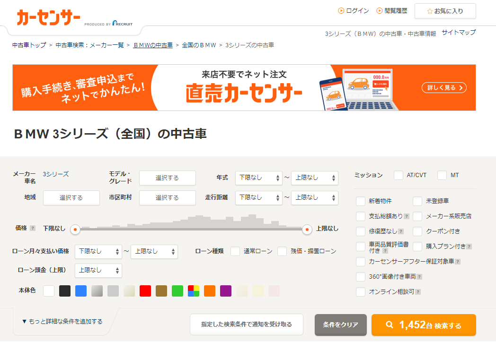
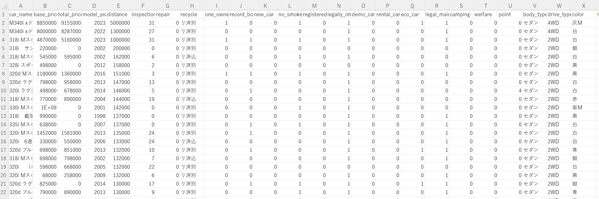
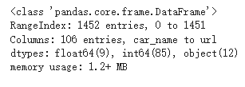
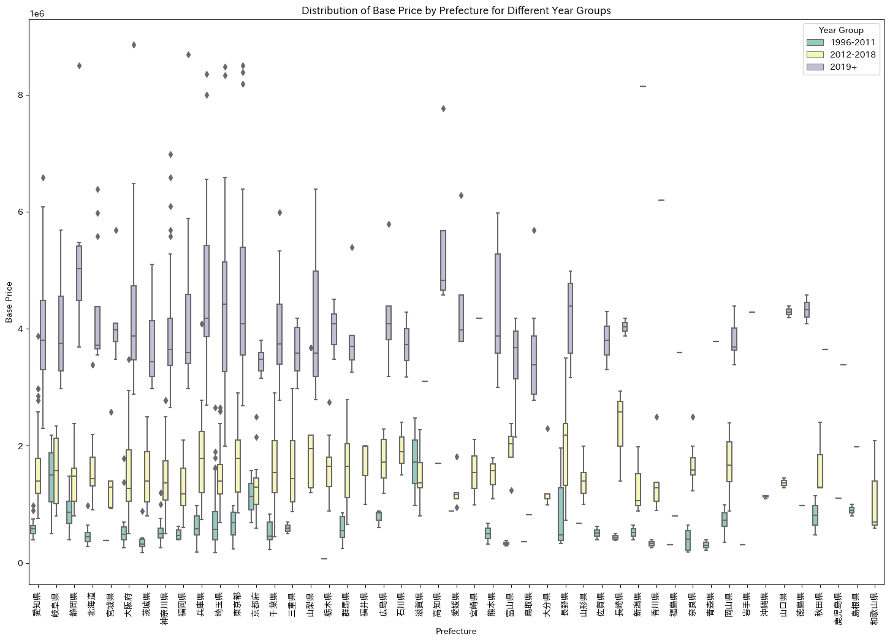

# 序言
---
自分が車を買ってからずっと、10年以上前の軽自動車を運転しています。現在運転している車はすでに16万キロ走行しています。
軽自動車は日常の買い物などには便利で、維持費も安いですが、パワー不足、スペースが狭い、長距離走行には向かないという欠点も確かにあります。
今は自分でお金を稼いでいるので、白いナンバープレートの普通車に乗り換えるつもりです。私がこれまで運転したことがあるすべての車の中で、
BMWの3シリーズが最も快適で安定していたので、今回は3シリーズを買うことを考えています。
中古車取引についてはある程度の経験があり、自分が満足できて安い車を見つける方法についても自分なりの考えがあります。
しかし、最近はデータサイエンスに関連する知識を学んでいるので、この機会に学んだことを実際に応用してみようと思いました。
データから車の価格に影響を与える要素が何か、その影響はどれほど大きいのか、今後の車選びで賢明な決定を下すのに役立つのかを見てみようと思います。


# ウェブページの内容をスクレイピングするコードの作成
---
CarSensor（日本の有名な中古車情報サイト）のホームページで車種を選択すると、結果がリスト形式でページごとに表示されます。
各結果には詳細ページに進むためのリンクがあります。私の目標とする車種はBMWの3シリーズなので、今回の検索結果はすべて3シリーズです。

<p style="font-size: 16px; line-height: 0.6;"><i>(このような結果が表示されます)</i></p>

そこで、私が考えた車両詳細情報をスクレイピングする手順は以下の通りです：  
***1.*** コードに検索結果ページのリンクを入力し、コードを実行します。  
***2.*** コードはまず検索結果が何ページあるかを確認し、そのページ数に基づいてループの回数を決定し、各検索結果ページを順に処理します。  
***3.*** 各検索結果ページで各車両の詳細ページを順に処理し、車両情報を抽出してcsvファイルに保存します。  


車両情報はHTMLから抽出できるため、今回はBeautifulSoupを使用して取得しました。  

### 車両基本情報の抽出
---
詳細ページの最上部には以下のような表があり、ここから車両の基本情報を抽出することができます。私のこれまでの経験から言うと、これらの情報は車両価格に最も大きな影響を与える要素です。
  
表の各情報はそれぞれ対応するパスがあり、そのためBeautifulSoupのCSSセレクタを使用して抽出することができます。
その中でも、年式の後の括弧内の和暦や、走行距離の後の「万km」などの文字列は、後のデータ分析で処理が難しくなる可能性があるため、
抽出段階でこれらの内容を処理することを考えています。具体的な処理内容は以下の通りです：  
***価格：*** 本体価格はCSS内で直接数字として格納されているため、コンマを取り除くだけで数値型になります。支払総額の基本形式は「数字+万円」または「---万円」で、
この場合は「万円」を取り除き、数字を10000倍して保存します。支払総額が表示されていないものはすべて0とします。
```python
if key == 'base_price':
  data[key] = element.get('content').replace(",", "")  # remove comma from the number
elif key == 'total_price':
  price_text = element.text.strip()  # remove leading/trailing whitespaces
    if price_text == "---万円":
      data[key] = "0"
    else:
      # remove '万円' and convert to the required format
      price_text = price_text.replace('万円', '')
      price_float = float(price_text) * 10000  # convert '万' to actual number
      data[key] = str(int(price_float))  # convert it to string without comma
```

***走行距離：*** これも価格と同様で、余分な文字列を取り除き、単位を変換するだけです。
```python
elif key == 'distance':
    distance_float = float(element.text) * 10000
    data[key] = str(int(distance_float))
```
***車検：*** サイト上の車検の表示方法は少々複雑で、「車検整備付」または「車検整備無」のみを書いているものもありますし、「YYYY年（和暦YY年）MM月」
の形式で書いているものもあります。私は車の価格に影響を与える要素は車検の残り有効期間であると考えているため、残り何ヶ月かという情報を保存するために計算を行うつもりです。
まず、「車検整備付」または「車検整備無」かどうかを判断し、それぞれ24と0を書きます。それ以外の内容の場合は、年と月の数字のみを抽出し、現在の時間を基準にして車検の有効期間があと何ヶ月残っているかを計算して保存します。
```python
elif key == 'inspection_remaining_month':
    inspection_elements = element.select('p')
    if len(inspection_elements) >= 2:
        inspection_text = inspection_elements[1].text
        if inspection_text == "車検整備付":
            data[key] = "24"
        elif inspection_text == "車検整備無":
            data[key] = "0"
        elif len(inspection_elements) >= 3:
            year_month_text = inspection_elements[1].text + inspection_elements[2].text
            # Use a regular expression to extract the year and month
            match = re.match(r'(\d{4})\(R\d{2}\)年(\d{1,2})月', year_month_text)
            if match:
                year = int(match.group(1))
                month = int(match.group(2))
                # Calculate the difference in months
                now = datetime.datetime.now()
                diff = (year - now.year) * 12 + month - now.month
                data[key] = str(diff)
            else:
                data[key] = year_month_text
    else:
        data[key] = None
```
***修復歴：*** 修復されたかされていないかの2種類しかないので、1と0の形式で直接保存します。
```python
elif key == 'repair':
    if element.text == 'なし':
        data[key] = 0
    elif element.text == 'あり':
        data[key] = 1
    else:
        data[key] = element.text
```
***地域：*** 地域が価格にどれほど影響を及ぼすのかは確信が持てませんが、以前に北海道のような雪が多い地域では下回りが錆びやすく、そのため安く売られていると聞いたことがあります。そこで、この機会に実際にこれを確認してみようと思います。
地域情報は“都道府県+市町村”の形式で表記されていますが、すべての販売者が“市町村”を書くわけではありません。そのため、地域情報は“都道府県”と“市”の2つの列に分けて保存するつもりです。
```python
elif key == 'region':
    # Split the text by the <br/> tag and save each part to the corresponding column.
    region_parts = element.decode_contents().split('<br/>')
    data['Prefecture'] = region_parts[0].strip() if len(region_parts) > 0 else None
    data['City'] = region_parts[1].strip() if len(region_parts) > 1 else None
```

### 車両状態情報の抽出
---
次に車両の状態を記述する表があります。

この表のほとんどの内容は「◯」と「ー」だけなので、前述の修理履歴と同様に1と0で置き換えます。また、文字列の内容は形式が確定しているため、文字列の内容を判断し、対応する情報を保存します。
```python
elif key in ['one_owner', 'record_book', 'new_car', 'no_smoke', 'registered', 'legally_imported',
             'demo_car', 'rental_car', 'eco_car', 'camping', 'welfare']:
    # If the text is '◯', store 1, otherwise store 0.
    data[key] = '1' if element.text.strip() == '◯' else '0'
```

表の下部には保証に関する内容があります（画像では表示されていません）。基本的な内容は保証があるかどうか、どのタイプの保証に属しているかなどで、これらの内容も2つの列に分けて保存します。
```python
elif key == 'legal_maintenance':
    # Check if the text is "法定整備付", "法定整備無", or "法定整備別" and store 1, 0, or 2 accordingly.
    text = element.text.strip()
    if '法定整備付' in text:
        data[key] = '1'
    elif '法定整備無' in text:
        data[key] = '0'
    elif '法定整備別' in text:
        data[key] = '2'
    else:
        data[key] = None
elif key == 'guarantee':
    # Check if the text contains "保証付" or "保証無", and "ディーラー保証" or "販売店保証".
    text = element.text.strip()
    if '保証付' in text:
        data['guarantee_exists'] = '1'
        if 'ディーラー保証' in text:
            data['guarantee_type'] = '1'
        elif '販売店保証' in text:
            data['guarantee_type'] = '0'
    elif '保証無' in text:
        data['guarantee_exists'] = '0'
        data['guarantee_type'] = None
```

### 基本スペックと装備仕様情報の抽出
---
基本スペックの部分の内容は比較的複雑なので、大部分の内容は元の文字列をそのままcsvに保存します。その後、LabelEncoderを使用してこの部分の内容を分析することも考えています。  
装備の情報は基本的に0と1で保存できます。特定の装備に細分化された内容がある場合は、「装備名_細分装備」の形式で列名を作り、データを0と1で保存します。この部分のコードは少し長いので、ここでは省略します。


# 車両情報のスクレイピング
---
上記の考え方に基づき、試行錯誤を繰り返した結果、最終的なコード[（リンク）](https://github.com/weils302/car_sensor_data_alnalysis/blob/main/car_scraper.py)を完成させました。
次は実際に実行することです。私が開始した時間は2023年8月1日22時30分で、その時点で検索ページ上の総車両数は1452台でした。その後のデータ分析もこの時間を基準に行います。

<p style="font-size: 16px; line-height: 0.6;"><i>(当時の総数は1452台)</i></p>

約30分の実行後、すべての車両情報を成功裏に取得し、csvファイルを生成しました。

<p style="font-size: 16px; line-height: 0.6;"><i>(コードの実行結果は1452台の車両情報を成功裏に取得したことを示しています)</i></p>

# データ分析
---
### データクレンジング
---
csvファイルが正常に保存されているかを確認するために、まずExcelでファイルを開いてみましたが、結果は文字化けとデータの欠損が一杯でした。

日本語のウェブページやOSでは、文字コードの問題が頻繁に発生するため、私は慌てずに、まず文字コードの問題から探し始めました。
ウェブページはutf-8でエンコードされており、私のcsvファイルもutf-8で保存されているため、日本語OSのExcelが問題の原因である可能性が高いです。
おそらく、Excelがファイルを開く際に正しい文字コードを使用できないのかもしれません。以前にBeautifulSoupを使用して文字コードの問題に遭遇したのはcp932が原因で、今回
インストラクターからもcp932を試してみるようにと言われたので、cp932で再保存するコードを書きました。
その中で「\xa0」に関するエラーが発生しましたが、これも実際にはスペースの一種であることがわかったので、すべての「\xa0」文字を通常のスペースで置き換えることで、Excelで正常に読み込まれるcsvファイルを得られました。
次はデータをGoogle Colabに移して次の処理を行うことです。
```python
import pandas as pd

df = pd.read_csv('data.csv', encoding='utf-8')

# Replace non-breaking spaces in the DataFrame with regular spaces
df = df.replace('\xa0', ' ', regex=True)
df.to_csv('car_price.csv', encoding='cp932', index=False)

```


まず、ColabでPandasを使用してデータを読み込みます。```info()```メソッドを使用してデータの情報を確認すると、1452行106列が正常に読み込まれたことがわかります。


今回は車種が一つだけなので、ある特徴（例えば、座席数やスライドドアの有無など）は一つの値しか持たない。これらの特徴は分析の価値がないので、最初の段階で削除します。
検索してみた結果、「'new_car', 'registered', 'camping', 'welfare', 'member', 'backseat_monitor', 'bench_seat', '3rd_row',
'walk_through', 'roof_rail', 'lift_up', 'slide_door'」などの項目は一つの値しか持たないため、これらの列のデータを削除します。 


その後、いくつかの列には全くデータがないか、明らかにデータが欠けていることがわかりました。また、分析には必要のないウェブページのリンクなどもあります。これらも全列を削除する必要があります。
以下の図の「City」は明らかにデータが欠けています。「guarantee_type」も明らかにデータが欠けていますが、次の分析でこれらのデータが必要になる可能性があるので、今は削除しません。


数行だけデータが欠けている要素については、全列を削除する必要はありません。対応する行を削除するだけでよいです。以下の図の「inspection_remaining_month」と「right_handle」がその例です。


処理後、最終的なデータは87列1432行になり、「guarantee_type」を除いてデータの欠損はありません。これで分析を進めることができます。


念のため、```describe()```メソッドを使用してデータを確認しましたが、まだ問題がありました。「base_price」と「distance」の最大値が正常ではありません。
価格の異常値に対応するウェブページを開いて確認したところ、販売店が「応談」と表示した価格はCSSに999999999と書かれていました。
また、走行距離の異常は、そのページの距離単位が'万km'ではないため、コードが自動的に10000を乗じて異常値になったためです。
そこで、価格が999999999のものはすべて0に変更し、距離が300000以上のものはすべて10000で割りました。これで、最終的にデータが正常になりました。


### データの視覚化と分析
---
#### ・車の年式と価格の関係
価格に大きな影響を与える要素として、まず年式から分析を始めました。まず、散布図を作成してみると、新しい車ほど高価であることがわかりますが、それ以上の内容は見えません。そこで、箱ひげ図に切り替えてみました。


箱ひげ図からは、1996年と1997年、2011年と2012年、2018年と2019年の間に大きな断層があることがわかります。サンプル数が少ない場合の個体差が結果に大きな影響を与えることを排除するため、各年式の車が何台あるかを再度確認しました。


2012年以前の車の数は少なく、特に2006年以前の車は少ないです。したがって、前述の1996年と1997年の間の価格の断層は、個体差が原因であると思われます。
一方、2011年と2012年の間では、価格だけでなく数量でも明らかな断層があり、これはモデルチェンジによる明らかな違いであると思います。
2012年に3シリーズはE90からF30にモデルチェンジしました。また、2018年と2019年の間では、数量に大きな違いはありませんが、価格の違いは2011年と2012年の違いよりも明らかです。
なぜなら、2019年以降の3シリーズは現行のG20で、価格が高いのは当然です。

先ほどの明らかな違いがある年を選び出し、KDE曲線を描いてみると、2012年、2018年、2019年の間のピークの価格の差は非常に明確で、約100万円以上の差があります。
これは私の以前の考えを裏付けています。現行モデルが最も高価で、前のモデルはやや安価で、さらに古いものは最も安価ですが、大きな違いはありません。


#### ・走行距離と価格の関係
以前の経験から考えると、多く走っている車は価格が比較的安いと考えられますが、その影響度ははっきりしていません。そこで、まず散布図を作成しました。図中の赤線は回帰線です。確かに、走行距離が長いほど車は安いです。


古い車ほど走行距離が長い可能性が高いと考え、散布図を以前のモデルチェンジの年に基づいてグループ分けし、再度作成しました。まず、これら三つのグループは価格において確かに大きな違いがあります。
また、回帰線から見ると、古い車については、走行距離が価格に与える影響は、現行モデルや前のモデルの影響ほど大きくないことがわかります。
現行モデルについては、走行距離が長い車の数がそれほど多くないため、走行距離が多い部分の回帰線は、前のモデルほど正確ではありません。


#### ・修復歴と価格の関係
修復歴は価格に大きな影響を与える要素の一つだと思います。私は以前から、一世代前の車の価格で修復歴のある次世代の車を買えると思っていました。
まず、すべての車の修復歴の有無と価格の差を箱ひげ図で見てみました。修復歴のある車は明らかに修復されていない車よりも安いことがわかります。


その後、以前のグループ分けの方法を用いて車を分けてみました。走行距離と同じく、2012年以前の車では修復の有無による価格の差はそれほど大きくないようですが、2012年以降の車では
修復された車が明らかに安いです。しかし、2019年以降の修復された車は、価格の変動範囲が広いため、修復されたものは必ずしも安いとは言えません。


#### ・残りの車検と価格の関係
まず、残りの有効な車検の月数と車の本体価格の関係を散布図で見てみましたが、車検が多いほど価格が高くなることは確かですが、影響はそれほど大きくないようです。


その後、車検は時々車の本体価格に含まれていないことを思い出しました。「車検整備付」の車の場合、一部の業者は車検の価格を「諸費用」に加え、
これは支払総額に含まれています。そのため、私は再び支払総額を取り出して分析しました。支払総額の結果は本体価格とほぼ同じです。  
より直感的に比較するために、私は車検と二つの価格の間のピアソン相関係数をそれぞれ計算しました。
本体価格は***0.1798***で、支払総額は***0.2076***でした。確かに車検は支払総額に対する影響がもっと大きいですが、全体的に見ると影響はそれほど大きくありません。


#### ・地域と価格の関係
最初はこの分析に対して明確な考え方がなかったので、とりあえず価格と地域（都道府県）のデータを取って箱ひげ図を作りました。
中央値から見ると、高知県、徳島県、青森県、和歌山県が最高と最低の位置にあります。しかし、この図からは他に何も見えないので、他の要素も考慮に入れることにしました。


この前の結論から、モデルチェンジは価格に大きな影響を与えると言えるので、各県の価格をモデルチェンジの年によってグループ化し、箱ひげ図を作りました。
これで、前述の4つの県は基本的に高価なものは最新モデルのみを販売し、安価なものは古いモデルのみを販売していることがわかります。
例えば、高知県は基本的に最新モデルしかなく、その価格は他の県よりも高いです。一方、青森県は最も古い車しかなく、価格は非常に安いです。


全体的に各地域の価格を把握するために、地域の平均価格の棒グラフも作りました。地域間の価格差は存在しますが、主な影響はその地域で販売されている車の新旧度と数量によるものです。


---
##### (地域についての余談)
この前北海道の雪の話をしたので、4WDの車を買うなら北海道で買うべきかどうかが気になりました。そこで、各県の車の数量と2WDと4WDの数量を視覚化してみました。
北海道は販売されている車の数量が少なくなく、4WDの数量が2WDの数量を上回る唯一の地域であることがわかります。今回は時間の関係で、
駆動方式と価格の関係をさらに分析しませんでした。これは今後の課題として深く探求することができます。


---

#### ・すべての要素が価格に与える影響度の分析
私が価格に大きな影響を与えると考えるいくつかの要素を分析した後、すべての要素について影響度のランキングを作成しました。コードは以下の通りです。
```python
# Set the target variable
y = df['base_price']

# Select the features to consider and exclude explicitly mentioned columns
features_to_consider_final = [
    col for col in df.columns.tolist()
    if col not in ['car_name', 'total_price', 'guarantee_type', 'base_price', 'year_group']
]

X_final = df[features_to_consider_final].copy()

# Identify categorical features in the dataset
categorical_features_final = [col for col in features_to_consider_final if df[col].dtype == 'object']

# Initialize the scaler and label encoder
scaler = StandardScaler()
le = LabelEncoder()

# Standardize 'distance' and 'model_year'
X_final[['distance', 'model_year']] = scaler.fit_transform(X_final[['distance', 'model_year']])

# Convert categorical features using LabelEncoder
for col in categorical_features_final:
    X_final[col] = le.fit_transform(X_final[col])

# Train the model using Random Forest
random_forest_regressor_final = RandomForestRegressor()
random_forest_regressor_final.fit(X_final, y)

# Get and sort feature importances
feature_importances_final = random_forest_regressor_final.feature_importances_
feature_importances_final_df = pd.DataFrame({
    'Feature': features_to_consider_final,
    'Importance': feature_importances_final
}).sort_values(by='Importance', ascending=False)

# Print each feature and its corresponding importance
for index, row in feature_importances_final_df.iterrows():
    print(f"{row['Feature']}: {row['Importance']*100:.2f}%")

```
結果から分かった影響度が最も大きいトップ10は以下の通りです：  
1. model_year: 80.55%  
2. displacement: 8.49%  
3. inspection_remaining_month: 3.70%  
4. distance: 2.01%  
5. transmission: 0.63%  
6. turbo: 0.52%  
7. Prefecture: 0.50%  
8. engine_type_gasoline: 0.26%  
9. color: 0.24%  
10. right_handle: 0.19%  

中でも、モデル年式の影響が最大で、次に車検と走行距離の影響も比較的大きいことが予想されました。意外だったのは、排気量の影響が2位にランクインし、
修復歴がトップ10に入らなかったことです。現在、ますます厳しい排出ガス基準と自動車税の値上げを考慮すると、大排気量の車はますます人気がなくなり、
市場での保有量が少なくなることが、車両価格に影響を与える可能性があります。今回は時間の都合上、より深い分析を行うことはできなかったが、排気量や他の要素は今後の分析課題として引き続き検討することができます。


# 結論
今回のデータ分析は、ある程度私の以前の経験を裏付けています。主に：
1. 年式、走行距離、車検は価格に大きな影響を与えます。
2. モデルチェンジにより、価格がそれぞれの範囲に集中します。
3. 地域は価格にある程度の影響を与えます。

また、私にとって予想外の結果もいくつかありました：
1. 排気量が価格に大きな影響を与えます。
2. 修復歴は価格にそれほど影響を与えません。
3. 地域の価格に影響を与える要素は、私が以前考えていたようなものではありません。
4. 古い年式の車にとっては、走行距離の影響はそれほど大きくないです。

分析の過程で、改善できる点もいくつか見つけました：
1. データのスクレイピング段階で、異常値の処理が十分ではありません。
2. 今回は一つの車種を対象に分析を行っただけで、今後はより多くの車種を比較する必要がある場合は、適切な改善が必要です。
3. 取得したデータはリアルタイムのデータではありません。CarSensorのようなウェブサイトでは、新しい車の情報が随時アップロードされる可能性があります。
今回のように、数千台の車の情報を基に分析を行う場合、1日で更新される車の情報はそれほど影響はありませんが、今後はリアルタイムで監視し、
分析データを取得するコードを作成できるようにしたいと思います。
4. 時間の関係で、今回は車両装備の部分の詳細な分析を行っていません。私は、この部分が将来的に価格により大きな影響を与えると考えています。
例えば、高齢化問題が深刻化するにつれて、自動ブレーキ機能やドライブレコーダーなどが、人々が車を購入する際の考慮要素になる可能性があります。
今後は、これらの機能を備えた中古車も増えてくるでしょうし、業者は価格設定の際にこれらの要素も考慮するでしょう。車両装備の分析も、今後深く分析できる内容だと思います。
5. 今後は、異なる客層に対して、彼らの要求に合った車のデータを分析する機能を作成できるようにしたいと思います。例えば、前述の高齢者は、
自動ブレーキ機能がより必要かもしれません。その場合、私はその点を基準に、どの車が良くて安いのかを分析できればと思っています。


今回はこれだけやりましたが、これから中古車を選ぶ際にはより自信が持つようになりました。そして、私が早く自分に最適な3シリーズを手に入れることを願っています。

---

<p style="font-size: 16px; line-height: 1;"><i>(参考リンク：https://www.carsensor.net/usedcar/search.php?CARC=BM_S011)</i></p>
<p style="font-size: 16px; line-height: 1;"><i>(この文章で使用されているデータは、2023年8月1日22時30分時点のものです。リンク先の内容が随時変わります。)</i></p>
