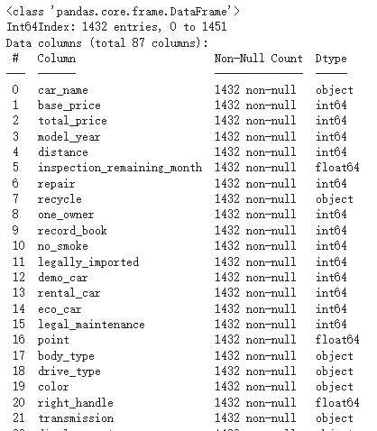

# 前言
---
自从自己买车开以来一直都是开着十几年前的轻车，现在开着的车更是已经跑了16万公里了。轻车虽然平时买菜什么的挺方便，维持费也便宜，但是
动力不足，空间小，不适合跑远路也确实是缺点。现在开始自己挣钱了，也就打算换一辆白牌子的普通车。在我之前开过的所有车中BMW3系是最舒服最稳的
一辆，所以这次考虑买一辆3系。对于二手车交易我自己有一定程度的经验，对于怎样找到自己满意又便宜的车也有自己的想法。不过最近学习了数据科学相关的
知识，就想着趁这个机会把学到的东西实际应用一下，从数据上看看影响车价的因素有哪些，会有多大的影响，能不能帮助我在今后的选车上做出明智的决策。

# 网页内容抓取代码编写
---
在CarSensor(日本一个很有名的二手车信息网站)主页上选择车型后结果会以列表形式分页显示，每一条结果又有对应的链接可以进入每一辆车的详情页。
由于我的目标车型是BMW的3系，所以这次的搜索结果全部都是3系。

<p style="font-size: 16px; line-height: 0.6;"><i>(就是这样的结果展示)</i></p>

所以我想到的抓取车辆详细信息的步骤如下：  
***1.*** 在代码中输入搜索结果页面的链接并运行代码。  
***2.*** 代码首先确认搜索结果一共有多少页，之后可以根据页面数量来确定循环次数并遍历每一个搜索结果页。  
***3.*** 在每一个搜索结果页上遍历每一个车辆详情页，从中提取车辆信息并保存到csv文件中。  


由于车辆信息能从HTML中提取到，所以我这次用了BeautifulSoup进行抓取。  

### 车辆基本信息提取
---
详情页的最上方有下图这种表格，从中可以提取车辆基本信息。以我之前的经验来讲，这些信息基本就是对于车价影响最大的要素了。
  
表格中的每个信息都有对应的路径，所以使用BeutifulSoup的CSS选择器就可以提取。其中像年式后面括号中的和历，行驶距离后面的“万km”等字符串在随后的
数据分析中会比较不好处理，所以我打算在抓取的阶段就对这些内容进行处理。具体处理内容如下：  
***价格：*** 本体价格在CSS中直接就是以数字存储的，所以只需要把其中的逗号去掉就是数值型了。总价的基本格式是”数字+万円“或者是“---万円”，此时
去掉“万円”并把数字乘以10000再储存。没有标出总价的一律写0。
```python
if key == 'base_price':
  data[key] = element.get('content').replace(",", "")  # remove comma from the number
elif key == 'total_price':
  price_text = element.text.strip()  # remove leading/trailing whitespaces
    if price_text == "---万円":
      data[key] = "0"
    else:
      # remove '万円' and convert to the required format
      price_text = price_text.replace('万円', '')
      price_float = float(price_text) * 10000  # convert '万' to actual number
      data[key] = str(int(price_float))  # convert it to string without comma
```

***行驶距离：*** 这个也和价格一样，只需去掉后面多余的字符串并进行单位换算。
```python
elif key == 'distance':
    distance_float = float(element.text) * 10000
    data[key] = str(int(distance_float))
```
***车检：*** 网站上车检的表示方式略复杂，有只写“車検整備付”或“車検整備無”的，也有以“YYYY年（和历YY年）MM月”这种格式写的。我觉得影响车价的因素
应该是剩余的车检有效期，所以打算通过计算把剩几个月这个信息存储起来。首先判断是否“車検整備付”或“車検整備無”，如果是就分别写24和0。如果是其他
内容，则只提取年和月的数字，以当前的时间为基准计算车检有效期还剩几个月并存储。
```python
elif key == 'inspection_remaining_month':
    inspection_elements = element.select('p')
    if len(inspection_elements) >= 2:
        inspection_text = inspection_elements[1].text
        if inspection_text == "車検整備付":
            data[key] = "24"
        elif inspection_text == "車検整備無":
            data[key] = "0"
        elif len(inspection_elements) >= 3:
            year_month_text = inspection_elements[1].text + inspection_elements[2].text
            # Use a regular expression to extract the year and month
            match = re.match(r'(\d{4})\(R\d{2}\)年(\d{1,2})月', year_month_text)
            if match:
                year = int(match.group(1))
                month = int(match.group(2))
                # Calculate the difference in months
                now = datetime.datetime.now()
                diff = (year - now.year) * 12 + month - now.month
                data[key] = str(diff)
            else:
                data[key] = year_month_text
    else:
        data[key] = None
```
***修复历史：*** 因为只有修过和没修过两种，所以直接以1和0的形式存储即可。
```python
elif key == 'repair':
    if element.text == 'なし':
        data[key] = 0
    elif element.text == 'あり':
        data[key] = 1
    else:
        data[key] = element.text
```
***地区：*** 我不确定地区对价格的影响有多大，但是之前有听说过像北海道这种地方下雪多，底盘容易绣，所以卖得便宜。所以这次想借这个机会实际验证一下。
地区信息在格式上是“都道府县+市町村”，但并不是所有商家都会写“市町村”，所以我打算把地区分为“Prefecture”和“City”两个列存储。
```python
elif key == 'region':
    # Split the text by the <br/> tag and save each part to the corresponding column.
    region_parts = element.decode_contents().split('<br/>')
    data['Prefecture'] = region_parts[0].strip() if len(region_parts) > 0 else None
    data['City'] = region_parts[1].strip() if len(region_parts) > 1 else None
```

### 车辆状态信息提取
---
接下来是描述车辆状态的表格

这个表格中大部分内容只有“◯”和“ー”，所以跟前面的修复历史一样用1和0代替。此外字符串的内容因为格式是确定的，所以可以判断字符串内容并保存相应的信息。
```python
elif key in ['one_owner', 'record_book', 'new_car', 'no_smoke', 'registered', 'legally_imported',
             'demo_car', 'rental_car', 'eco_car', 'camping', 'welfare']:
    # If the text is '◯', store 1, otherwise store 0.
    data[key] = '1' if element.text.strip() == '◯' else '0'
```

表格下方还有关于保修的内容（图中没能显示），基本内容为是否有保修，属于什么类型的保修，这些内容我也分成了两个列保存。
```python
elif key == 'legal_maintenance':
    # Check if the text is "法定整備付", "法定整備無", or "法定整備別" and store 1, 0, or 2 accordingly.
    text = element.text.strip()
    if '法定整備付' in text:
        data[key] = '1'
    elif '法定整備無' in text:
        data[key] = '0'
    elif '法定整備別' in text:
        data[key] = '2'
    else:
        data[key] = None
elif key == 'guarantee':
    # Check if the text contains "保証付" or "保証無", and "ディーラー保証" or "販売店保証".
    text = element.text.strip()
    if '保証付' in text:
        data['guarantee_exists'] = '1'
        if 'ディーラー保証' in text:
            data['guarantee_type'] = '1'
        elif '販売店保証' in text:
            data['guarantee_type'] = '0'
    elif '保証無' in text:
        data['guarantee_exists'] = '0'
        data['guarantee_type'] = None
```

### 规格和设备信息提取
---
规格这一部分的内容比较复杂，所以大部分内容我就把原本的字符串直接保存到csv中。随后我也有考虑使用LabelEncoder分析这部分内容。  
设备的信息基本也可以用0和1来储存，某种设备里有细分的内容的话我就以“设备名_细分设备”的格式作为列名并以0和1存储数据。这一段代码略长，就不写了。


# 车辆信息的自动抓取
---
按照以上的思路，经过不断试错终于写好了最终代码[（链接）](https://github.com/weils302/car_sensor_data_alnalysis/blob/main/car_scraper.py)。
接下来就是实际运行了。我开始的时间是2023年8月1日22点30分。当时搜索页面上的总车数为1452个，我之后分析的数据也已这个时间为准。

<p style="font-size: 16px; line-height: 0.6;"><i>(当时的总数量为1452)</i></p>

经过大概30分钟的运行，成功抓取所有车辆信息并生成了csv文件。

<p style="font-size: 16px; line-height: 0.6;"><i>(代码运行结果显示成功抓取1452个车辆信息)</i></p>

# 数据分析
---
### 数据清洗
---
为了检查csv文件是否正常保存，我首先用Excel打开了该文件，结果是一堆乱码以及数据缺失。

由于日文网页以及操作系统经常会出现文字编码的问题，所以我也没慌，直接从文字编码的问题上开始找。因为网页是utf-8编码，我的csv文件也是以utf-8为存储的，
所以问题大概率是在日语操作系统中的Excel上出现的。可能是Excel在打开文件时无法使用正确的文字编码。
因为之前唯一一次用BeautifulSoup碰到的文字编码问题是cp932引起的，此外这次老师也跟我说试试cp932看看，所以我直接就写了一段以cp932转存的代码。
其中碰到关于“\xa0”的报错，查了一下其实这也是一种空格，于是用普通空格代替所有“\xa0”字符就得到了一个能用Excel正常读取的csv文件。接下来就是把数据放到Google Colab中进行下一步处理了。
```python
import pandas as pd

df = pd.read_csv('data.csv', encoding='utf-8')

# 替换 DataFrame 中的非断空格为普通空格
df = df.replace('\xa0', ' ', regex=True)
df.to_csv('car_price.csv', encoding='cp932', index=False)

```


在Colab中首先用Pandas来读取数据。用```info()```方法查看数据的信息，发现1452行106列已被成功读取。


由于这次只有一个车型的数据，所以有些特征（比如座位数，是否有侧滑门等）只有一种数值。这些特征没有分析的价值，从一开始就可以删除掉。经过挑选，发现
“'new_car', 'registered', 'camping', 'welfare', 'member', 'backseat_monitor', 'bench_seat', '3rd_row', 'walk_through', 'roof_rail', 'lift_up', 'slide_door'”
等项目只有一种数值，所以把这些列的数据删掉。 

之后我又发现有一些列完全没有数据或有明显的数据缺失，还有像网页链接在分析中也不需要，这些也需要把整列删掉。如下图中的“City”就是有明显缺失的数据。
“guarantee_type”也有明显的缺失，但是我在考虑接下来的分析中可能用得上这些数据，所以暂时没有删除。


对于那些只有几行缺失数据的要素，没有必要把整列都删掉，只需要把对应的行删除掉即可。如下图中的”inspection_remaining_month“和“right_handle”。


处理之后最后的数据剩下87列1432行，除了“guarantee_type”之外没有缺失的数据，可以进行分析了。


为了以防万一，我还用```describe()```方法查看了一下数据，结果发现还有问题。”base_price“和”distance“的最大值不正常。我打开价格异常值对应的网页
查看了一下，发现被商家标为”応談“的价格在CSS中写着999999999。而行驶距离异常是因为该页面上的距离单位并不是“万km”,所以代码自动乘以10000导致了
数值错误。于是我把价格为999999999的一律改为0，距离大于300000的一律除以10000，最后数据终于变正常了。


### 数据可视化及分析
---
#### ・车辆年式与价格的关系
作为一个能很大程度影响价格的要素，我首先从年式开始分析。首先试着用散点图显示，发现能看出来越新的车越贵，但是看不出更多的内容了。于是我再换到
箱线图看了看。


从箱线图能看出1996和1997，2011和2012，2018和2019之间有很大的断层。为了排除样本数量过少时少量个体对结果过大的影响，我又看了下每个年份的车有多少辆。


可以看出2012年以前的车数量较少，尤其是2006年以前的。所以前面1996和1997年之间的价格断层应该只是个体差异导致的。而2011和2012年之间不管价格还是
数量都有着明显的断层，我认为是因为换代导致的明显差异。在2012年3系从E90换代到了F30。而2018和2019之间虽然数量上没有大的差别，但是价格差异比
2011和2012的差异更为明显。因为2019年以后的3系就是现行款的G20，价格较贵也是毋庸置疑的。

我把刚才差异明显的几个年份挑出来绘制了KDE曲线，发现2012，2018和2019年之间的峰值处的价格差距很明显，大概相差100多万。这也印证了我之前的想法，
现行款最贵，前一代略便宜，再旧一些的最便宜，但是也没有什么大的差别。


#### ・行驶距离与价格的关系
按照以前的经验来看，跑得多的车价格会比较便宜，但是其影响程度如何并不清楚。所以我首先也是做了一个散点图。图中的红线为回归线。可以看得出，
确实是跑得越多的车越便宜。


考虑到越旧的车行驶距离越多的可能性越大，所以我把散点图按照之前换代的年份进行分组重新做了一遍。首先可以看得出这三组在价格上确实有比较大的差异。
其次从回归线能看出来对于旧车来讲行驶距离对于价格的影响没有现行款和上一代车的影响那么大。对于现行款，因为跑得多的车的数量也不多，所以在行驶距离多
的部分其回归线并没有上一代的那么准确。


#### ・修复历史与价格的关系
修复历史也是影响价格的一大要素。我之前一直觉得用买上一代车型的钱就能买到有修复历史的下一代车。首先我用箱线图看了下所有车辆当中有无修复历史的价格差距。
可以看得出有修复历史的车明显比未修复的车便宜不少。


随后我也用之前的分组方法对车辆进行了分组。可以看出，跟行驶距离一样，对于2012年以前的车修没修过似乎价格的差异并不大，对于2012年以后的车，修过的
车明显更便宜。但是2019年以后的修复过的车，其价格变化区间比较大，所以并不能断言修过的就绝对便宜。


#### ・剩余车检与价格的关系
首先我用散点图看了下剩余有效车检的月数与车辆本体价格之间的关系，发现虽然车检越多价格越高，但是影响似乎并不明显。


后来我突然想到，车检有时并不是算在车辆本体价格当中。对于有些“車検整備付”的车来说，有些商家会把车检的价格加到“諸費用”当中，而这一部分是被包含在
了总体价格中。所以我又把总价拿过来分析了一下。可以看出总价的结果跟本体价格也差不多。  
为了更直观地对比，我又分别计算了车检与两种价格之间的皮尔逊相关系数，
本体价格为***0.1798***,总价为***0.2076***。确实车检对总价的影响更高，但是整体来讲影响并不大。


#### ・地域与价格的关系
一开始我对于这个分析并没有明确的思路，索性直接把价格和地域(都道府县)的数据拿来做了一个箱线图。从中位数可以看得出高知县，德岛县，青森县，和歌山县
处在最高和最低的位置。但是从这个图中并不能看出其他什么，所以我考虑把其他要素也考虑进来。


因为之前得出的结论表示换代对价格的影响较大，所以我把每个县的车价按换代的年份进行了分组并做了箱线图。这下就能看出来前面提到的四个县基本就是价格
高的只卖最新款，价格低的只卖旧款。像高知县，基本只有最新款，且其价格也比其他县高。而青森县则只有最旧的车，且价格非常便宜。


为了整体上把握每个地区的价格，我又做了一个地域平均价格的柱状图。可以看出地域之间价格的差异是存在的，但是主要影响还是在于该地区所贩卖车辆的
新旧程度以及数量。


---
##### (关于地域的题外话)
因为之前提到过北海道下雪的事情，我就比较好奇是不是想买4WD的车话应该去北海道买。于是我顺便可视化了一下每个县的车辆数量以及2WD和4WD分别的数量。
可以看得出北海道在卖的车数量不算少，且确实是唯一一个4WD数量比2WD数量多的地区。这次因为时间关系，并没有继续分析驱动方式和价格的关系。这一点
确实可以作为以后的课题继续深究。


---

#### ・所有要素对于价格的影响程度分析
在分析过我认为对价格影响程度比较大的几个要素后我给所有的要素做了个影响程度的排名。代码如下：
```python
# 设定目标变量
y = df['base_price']

# 选择要考虑的特征，并排除明确提出的列
features_to_consider_final = [
    col for col in df.columns.tolist()
    if col not in ['car_name', 'total_price', 'guarantee_type', 'base_price', 'year_group']
]

X_final = df[features_to_consider_final].copy()

# 找出数据集中的分类特征
categorical_features_final = [col for col in features_to_consider_final if df[col].dtype == 'object']

# 初始化标准化器和标签编码器
scaler = StandardScaler()
le = LabelEncoder()

# 对 'distance' 和 'model_year' 进行标准化
X_final[['distance', 'model_year']] = scaler.fit_transform(X_final[['distance', 'model_year']])

# 使用 LabelEncoder 转换分类特征
for col in categorical_features_final:
    X_final[col] = le.fit_transform(X_final[col])

# 使用随机森林训练模型
random_forest_regressor_final = RandomForestRegressor()
random_forest_regressor_final.fit(X_final, y)

# 获取并排序特征重要性
feature_importances_final = random_forest_regressor_final.feature_importances_
feature_importances_final_df = pd.DataFrame({
    'Feature': features_to_consider_final,
    'Importance': feature_importances_final
}).sort_values(by='Importance', ascending=False)

# 打印每个特征及其对应的重要性
for index, row in feature_importances_final_df.iterrows():
    print(f"{row['Feature']}: {row['Importance']*100:.2f}%")

```
从结果得知影响程度最大的前十名为：  
1. model_year: 80.55%  
2. displacement: 8.49%  
3. inspection_remaining_month: 3.70%  
4. distance: 2.01%  
5. transmission: 0.63%  
6. turbo: 0.52%  
7. Prefecture: 0.50%  
8. engine_type_gasoline: 0.26%  
9. color: 0.24%  
10. right_handle: 0.19%  

其中年式的影响最大，其次车检和行驶距离影响也相对较大，这都是在预料之中的。比较意外的是排量的影响居然能排到第二，且修复历史都没有进前10。
考虑到现在越来越严苛的排放标准以及自动车税涨价，大排量的车越来越不受欢迎，从而导致市场当中的保有量少，这也可能影响到了车辆的价格。这次因为
时间的原因并没有进行更深入的分析，排量以及其他要素可以作为今后的分析课题继续进行探讨。

# 结论
此次的数据分析一定程度上印证了我之前的经验，主要有：
1. 年式，行驶距离，车检在很大程度上影响着价格。
2. 换代使得价格出现了各自集中的区间。
3. 地区对价格有一定影响。

此外也有不少对我来说意想不到的结果：
1. 排量对于价格影响比较大。
2. 修复历史对价格影响并不大。
3. 影响地区价格的因素并不像我之前想的那样。
4. 对于老旧的车型来讲行驶距离的影响并不大。

在分析的过程中我也发现了不少可以改进的地方：
1. 在数据抓取的过程中对于异常值的处理不够彻底。
2. 此次只是以一种车型为目标进行了分析，今后如果需要对比更多车型时需要进行相应的改进。
3. 抓取的数据并不是实时数据。像CarSensor这种网站随时都有可能新的车辆信息被上传。虽然对于这次这种以上千辆车的信息为基础进行的分析来讲，
一天内更新的车辆信息没什么影响，但是我希望之后可以做到实时监控并提取分析数据的代码。
4. 因为时间的关系这次并没有详细分析车辆设备部分的内容。我认为这一部分在将来可能会更多地影响价格。举例来讲，随着老龄化问题的加深，今后像自动刹车功能，行车记录仪等等估计也会成为人们买车时
考虑的因素。今后带有这些功能的二手车也会越来越多，车商在定价是肯定也会考虑这些要素。关于车辆设备的分析也是今后可以深入分析的内容。
5. 我希望之后可以做一个针对不同群体可以分析符合他们要求的车辆数据的功能。比如上一条提到的老年人，可能更需要自动刹车功能，那么我就可以以这一点
为标准分析一下哪种车又好又便宜。


这次做了这么多，对于之后挑选二手车更有信心了。也希望我能早日买到最适合我的那一辆3系吧。
