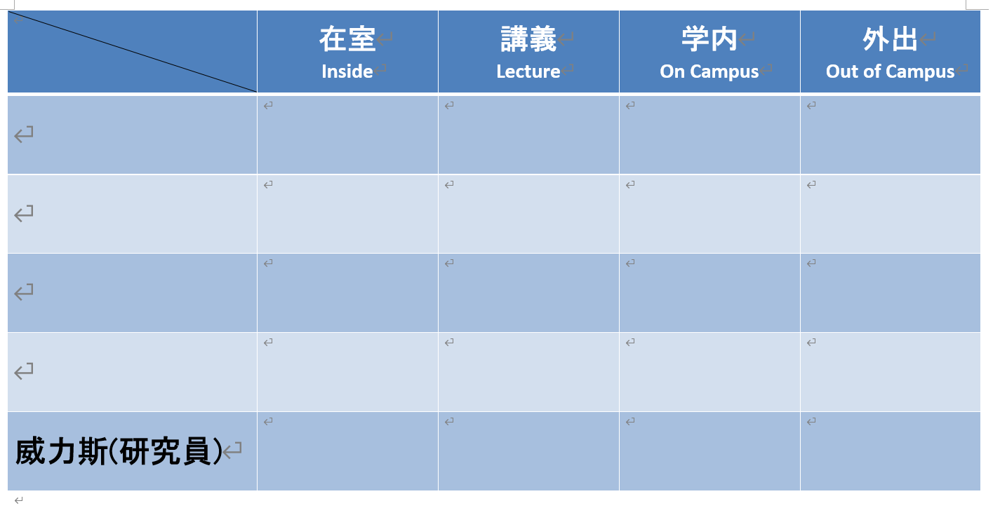

Since I recently got my own office, I thought about putting a privacy sign on my door like I did in the previous research lab.

<i>(The sign looks something like this list, with other names removed)</i>

While searching for privacy sign designs to reference, I found a post[*(url)*](https://www.sakaikoheilab.com/2021/09/lab-door),
and its whiteboard and illustrations format struck me as quite nice. However, realizing that my drawing skills are not up to par, 
and the whiteboard only has two sides (which does not fulfill my requirements because I need more than just "in the room" and "out of the room"),
I could not completely replicate the plan from the post.

Eventually, I thought of the recent trend of various AI tools and came up with a slightly audacious solution to the above problems:   
**\*Lack of drawing skills:** Midjourney can solve this.  
**\*The whiteboard only has two sides:** An electronic version could be made using a monitor, capable of displaying various statuses.  
**\*Control of the monitor:** Could be done with a spare Raspberry Pi or small laptop.

Given the need for electronic equipment like monitors, considering theft prevention and power cord arrangements,
I cannot put the device outside the door. If I put it inside the door, people outside can only see it through the glass
on the door. Since a large part of the glass on the door is obstructed, I would need to place the monitor on the unobstructed
upper portion.

<i>(This is the situation with the glass on the door)</i>

I can't drill holes in the door, so I plan to fix it in place with magnets and install a bracket. However, if I use magnets,
a small laptop may be too heavy to hold, so in the end, I plan to use a Raspberry Pi and a small portable monitor.

After deciding the hardware, I started thinking about how to display the images and came up with the following options:  
**1.** Connect a keyboard and mouse to the Raspberry Pi, store the status images in the Raspberry Pi, and select the image to display directly with the keyboard and mouse.    
**2.** Use a touch-sensitive monitor, store the images in the Raspberry Pi, and select the image to display through touch.    
**3.** Connect the Raspberry Pi wirelessly to the room's local network and install a VNC Server, store the images in the Raspberry Pi, 
and select the image to display remotely through a VNC Viewer on my working desktop.  
**4.** Connect the Raspberry Pi wirelessly to the room's local network, store the images on my desktop, and send the image to be displayed to the Raspberry Pi each time.

Since there is no suitable space near the door to place a keyboard and mouse, and each time I change the status, I need to remove the monitor,
it's not very convenient. So, I discarded the first two options. Both options 3 and 4 require a wireless connection and remote control.
In line with the idea of **"using technology to simplify complex and repetitive processes"** ,I think the best plan is to 
build on the 4th option by creating a console. I won't have to select the images myself, but just tell the Raspberry Pi 
my current status and let the program choose and display the image for me. The images are stored on my regular work computer, 
making it easy to expand and maintain the image library without touching the Raspberry Pi. I wasn't sure about the specific implementation, 
so I asked ChatGPT for help.

<i>(This seems like a feasible plan)</i>

The next step is to verify the feasibility of ChatGPT's code, and then to create the images.

---
*Upcoming content:*  
*[Making a Digital Office Door Sign Based on AI Application (Part 2)](https://weils302.com/en/techblog/status_list_2_20230415/)*  
*[Making a Digital Office Door Sign Based on AI Application (Part 3)](https://weils302.com/en/techblog/status_list_3_20230418/)*
