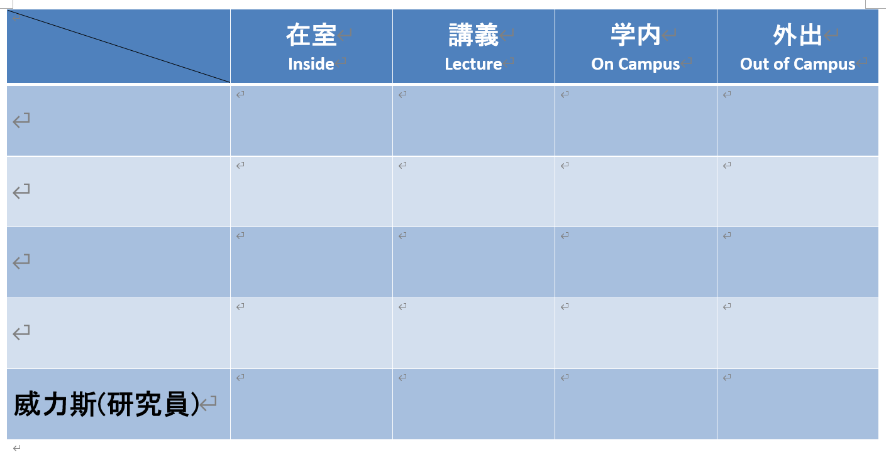
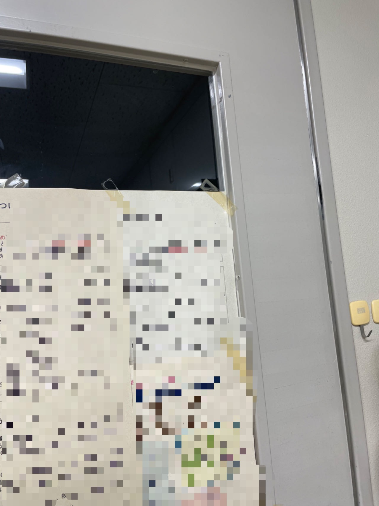
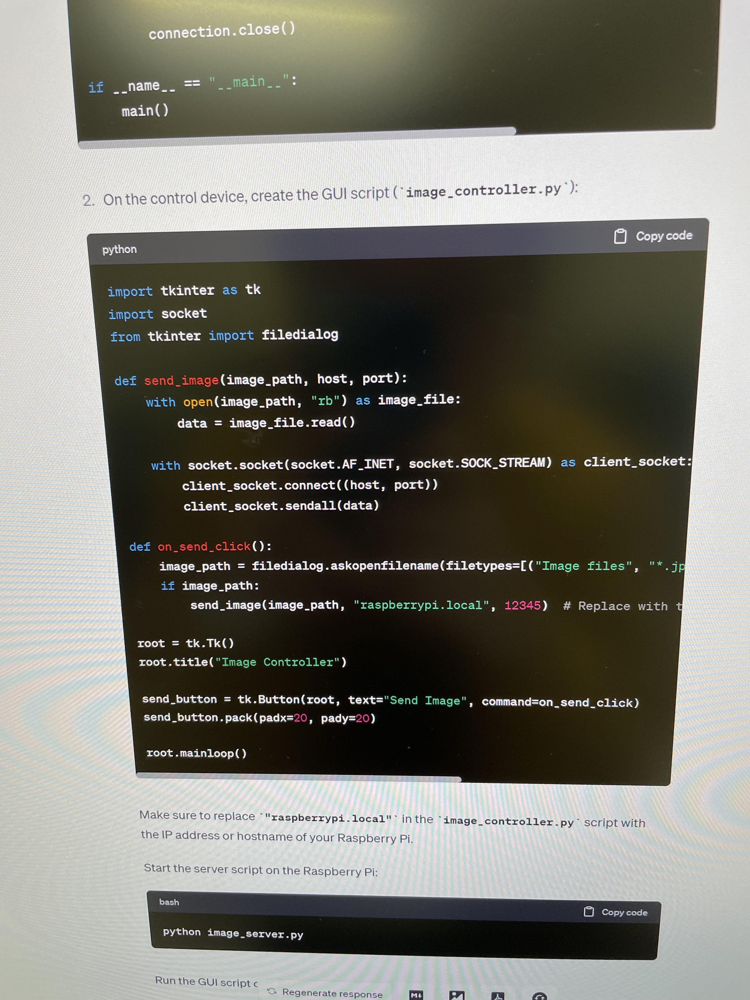

最近、自分のオフィスを手に入れたので、前の研究室のようにドアに在室表を設置しようと考えました。

<i>(在室表はこのようなもので、他の名前は削除しました)</i>

在室表のデザインを参考に探しているときに、ある投稿[*(リンク)*](https://www.sakaikoheilab.com/2021/09/lab-door)を見つけました。
そのホワイトボードとイラストの形式は、とても良いと思いました。しかし、私の絵画のスキルはそれほど高くないし、ホワイトボードには二つの面しかないため、
私の要件（"在室"と"不在"だけでなく、他にも必要な状態がある）を満たせません。そのため、この投稿のプランを完全にはコピーできないです。

結局のところ、最近様々なAIツールが流行っていることを考えて、上記の問題に対する若干大胆な解決策を思いつきました：  
**\*絵画のスキルがない：** Midjourneyを使えば解決できます。  
**\*ホワイトボードには二つの面しかない：** モニターを使って電子版を作れば、さまざまな状態を表示できます。  
**\*モニターのコントローラー：** 使われていないRaspberry Piや小型のラップトップコンピュータを使用します。

モニターなどの電子機器が必要なため、盗難防止や電源コードの配置などを考慮すると、このデバイスをドアの外に置くことはできません。もしドアの内側に置くと、
外側の人々はドア上のガラス越しにしかそれを見ることができません。ドア上のガラスの大部分が遮られているため、モニターは遮られていない上部に置く必要があります。

<i>(ドアのガラスはこんな感じです)</i>

このドアには穴を開けることができないので、磁石を使って固定し、ブラケットを設置するつもりです。しかし、磁石を使うと、
小型のラップトップコンピュータは重すぎて保持できないかもしれないので、最終的にはRaspberry Piと小型の携帯用モニターを使用するつもりです。

ハードウェアを決定した後、画像の表示方法を考え始め、以下のようなオプションを思いつきました：  
**1.** Raspberry Piにキーボードとマウスを接続し、在室状態の画像をRaspberry Piに保存し、キーボードとマウスを使って画像を直接選択して表示します。  
**2.** タッチセンシティブなモニターを使用し、画像をRaspberry Piに保存し、タッチで画像を選択して表示します。  
**3.** Raspberry Piを部屋のローカルネットワークに無線接続し、VNC Serverをインストールします。画像はRaspberry Piに保存し、デスクトップのVNC Viewerを使ってリモートで画像を選択して表示します。  
**4.** Raspberry Piを部屋のローカルネットワークに無線接続し、画像をデスクトップに保存します。それから毎回、表示する画像をRaspberry Piに送信して表示します。

ドアの近くにキーボードやマウスを置く適当なスペースがなく、また、ステータスを変更するたびにモニターを外さなければならないため、非常に便利ではありません。
そのため、最初の二つのオプションはすぐに却下されました。オプション3と4の両方とも無線接続が必要で、リモートコントロールが必要です。
 **「技術を使って複雑で反復的なプロセスを簡素化する」** 考えに基づいて、私は最良のプランは4番目のオプションに基づいてコンソールを作り、自分で画像を選ばず、
現在の状態をRaspberry Piに伝えてプログラムが画像を選択して表示させることだと思います。画像は普段使っているデスクトップに保存され、Raspberry Piに触れることなく画像ライブラリを
拡張・維持することが容易です。具体的な実装方法についてはよくわからなかったので、私はChatGPTに助けを求めました。

<i>(これは実行可能な計画のようです)</i>

次のステップは、ChatGPTのコードの実行可能性を確認し、その後、画像を作成することです。

---
*今後の記事：*  
*[AIアプリケーションに基づく電子在室表作成 (2)](https://weils302.com/techblog/status_list_2_20230415/)*  
*[AIアプリケーションに基づく電子在室表作成 (3)](https://weils302.com/techblog/status_list_3_20230418/)*
