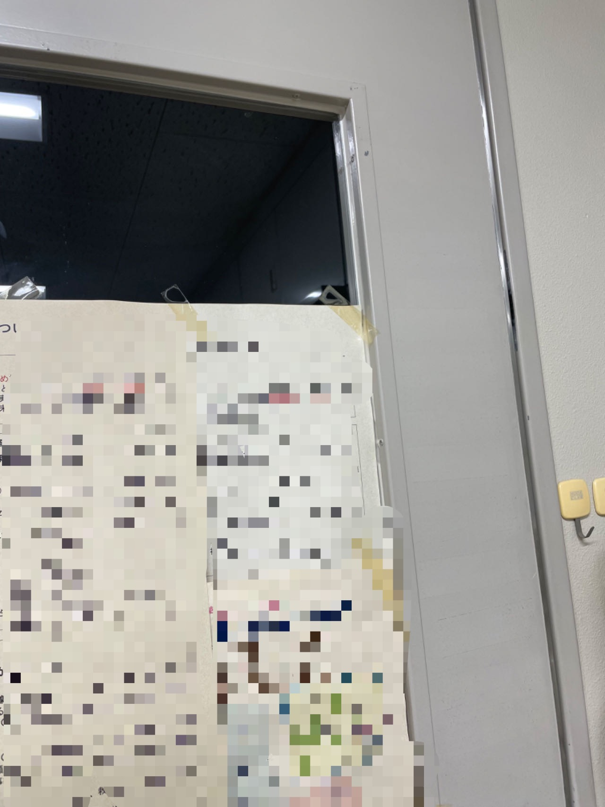
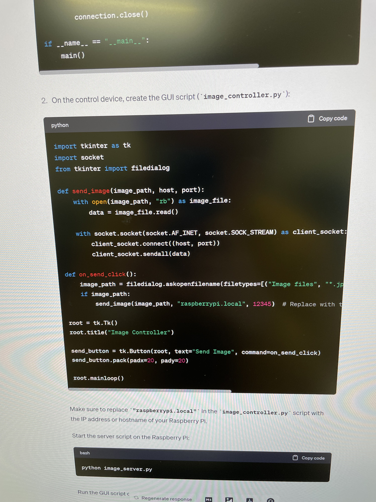

由于最近有了自己的办公室，想着像之前的研究室那样在门上放一个在室表。

<i>(就是类似这样的表格，已经删除了其他人的名字)</i>

在找可以借鉴的在室表设计时找到一个帖子[*(链接)*](https://www.sakaikoheilab.com/2021/09/lab-door)，
其白板+插画的形式我觉得挺不错。但是后来一想，我绘画能力还没那么厉害，而且白板只有两个面，也没法满足我的需求
（因为我需要的不止有“在室”和“不在”两种），所以不能完全复制这个帖子里的方案。

最后我想到最近有各种AI工具比较火，所以对于以上问题的解决方法我有了一个略大胆的方案：  
**\*不会绘画：** 可以用Midjourney解决。  
**\*白板只有两面：** 可以用显示器做个电子版的，多少种状态都可以显示。  
**\*显示器的控制器：** 闲置的树莓派或小型笔记本电脑。

由于需要用到显示器等电子器件，考虑到防盗以及电源线配置等问题，不能把这个设备放在门外面。
如果放在门的里面，只能透过门上的玻璃让外面的人看到。因为这个门上的玻璃下面很大一部分被挡住了，所以需要把显示器放在上面没被挡住的地方。

<i>(门上的玻璃是这么个情况)</i>

这个门上不能打孔，所以打算用磁铁固定并安装一个支架。但是用磁铁的话小型笔记本电脑太沉，可能吸不住，所以最后打算用树莓派和小型便携显示器。

确定硬件后我开始考虑如何实现图片的显示，想到如下几种方案：  
**1.** 树莓派连接键盘鼠标，在室状态图储存在树莓派中，直接用键盘鼠标选择图片显示。  
**2.** 选用可触控显示器，图片储存在树莓派中，触控选择图片显示。  
**3.** 树莓派无线连接房间局域网并安装VNC Server，图片储存在树莓派中，通过工作用台式机上的VNC Viewer远程选择图片显示。  
**4.** 树莓派无线连接房间局域网，图片储存在工作用台式机上，每次向树莓派传送需要显示的图片并显示。  

由于门附近没有适合摆放键盘鼠标的空间，且每次更改状态都需要取下显示器，并不是很方便。所以1号2号方案首先被Pass掉。
3号和4号都需要连接无线网，需要远程控制。本着 **“用技术解决复杂重复的流程”** 的想法，我觉得最好的方案应该是在4号方案的基础上
做一个控制台，我不需要亲自选图，而是直接告诉树莓派我现在的状态，让程序帮我选图并显示。图片存储在常用的工作电脑上，以后在不碰树莓派的情况下
扩展维护图片库也很方便。对于具体实现方式我并不是很清楚，于是我找了ChatGPT帮忙。

<i>(看起来是一个可行方案)</i>

下一步就是验证ChatGPT代码的可行性，然后进行图片的制作。

---
*后续内容：*  
*[基于AI应用的电子在室表制作（二）](https://weils302.com/zh/techblog/status_list_2_20230415/)*  
*[基于AI应用的电子在室表制作（三）](https://weils302.com/zh/techblog/status_list_3_20230418/)*
