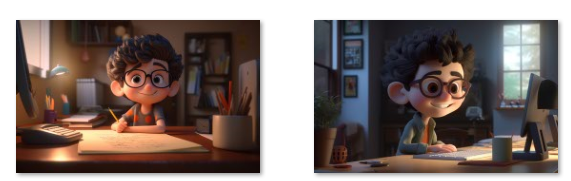

*Previous content:*  
*[Making an Electronic Office Door Sign Based on AI Application (Part 1)](https://weils302.com/en/techblog/status_list_1_20230407/)*

---

Once the idea is decided, it needs to be put into action. Here are what I need to do next  
**\*Creating images with Midjourney**  
**\*Making a support bracket**  
**\*Testing the code**  

In this post, I will mainly talk about the process of creating images.

## Creating Images with Midjourney
--------------------
<div style="text-align: justify;">
My initial idea was to create a character in the style of Pixar's 3D animations, based on myself as the prototype, 
and place this character in different environments based on my status. For instance, if I am in my room, 
the display would show this cartoon character sitting at a desk, and if I am on campus, 
it would display an image of the character walking around the campus. Based on this idea, 
I first used my own photo to generate images in the corresponding style.
</div>


<p style="font-size: 16px; line-height: 0.6;"><i>(Here are a few versions generated from the picture on the homepage)</i></p>

<div style="text-align: justify;">
These pictures indeed have the style I wanted, so I decided to keep the seed from the upper right picture for scene changes.
After several attempts to create scenes with me sitting at the desk, I found that the pictures generated from a seed
seemed to keep the composition of the original image, making the desk the background, which is not what I wanted.
</div>


<p style="font-size: 16px; line-height: 0.6;"><i>(All these pictures feature the character standing in front of the desk)</i></p>

<div style="text-align: justify;">
In the end, I decided to abandon the use of seed for image generation. I thought that
"wavy short black hair + glasses" could, to some extent, generate characters with my characteristics, 
so I added these keywords to the prompt to replace the seed from the original picture. 
Finally, the first picture I was satisfied with was created.
</div>


<p style="font-size: 16px; line-height: 0.6;"><i>(The prompt is as follows:</i></p>

```
a cute boy with wavy short black hair, smiling, sitting in front of a PC, desktop computer, eyeglasses, sunshine from window, 3d art, c4d, octane render, ray tracing, popmart blind box, clay material, Pixar trend --ar 16:10 --v 5 --q 2 --s 750
```
<p style="font-size: 16px; line-height: 0.6;"><i>)</i></p>

<div style="text-align: justify;">
My original plan was to change the scenes in the pictures according to the weather. So I tried to change the "sunshine" part
in the prompt of the previous picture to "rain outside the window". However, 
the AI seemed not to understand my intention and just added some droplets next to the character. 
The result did not meet my expectations, and it seemed difficult to adjust, so I gave up temporarily.
</div>


<p style="font-size: 16px; line-height: 0.6;"><i>(The new prompt didn't work well)</i></p>

<div style="text-align: justify;">
It was not that difficult to represent the states of "off campus" and "on campus" 
when portraying a rainy scene. I managed to create several images at once.
</div>


<p style="font-size: 16px; line-height: 0.6;"><i>(off campus)</i></p>


<p style="font-size: 16px; line-height: 0.6;"><i>(on campus)</i></p>

I then used the same method to create images for other statuses such as "in the room", "in the canteen", and "back home".

<p style="font-size: 16px; line-height: 0.6;"><i>(in the room)</i></p>


<p style="font-size: 16px; line-height: 0.6;"><i>(in the canteen)</i></p>


<p style="font-size: 16px; line-height: 0.6;"><i>(back home)</i></p>

<div style="text-align: justify;">
In the end, I felt that although the backgrounds could express my current state, they couldn't achieve an effect 
that was immediately clear. So I used a "dumb method"—I added the text of the current state to these images 
on my iPad using Procreate. That's how I completed the image part.
</div>


<p style="font-size: 16px; line-height: 0.6;"><i>(The images with text added)</i></p>

<div style="text-align: justify;">
In my imagination, it would be best to have a GIF-like Lofi Girl. 
But currently, AI is not very convenient for creating GIFs, so this can be considered as a future plan.
</div>

---
*Upcoming content:*  
*[Making an Electronic Office Door Sign Based on AI Application (Part 3)](https://weils302.com/en/techblog/status_list_3_20230418/)*
