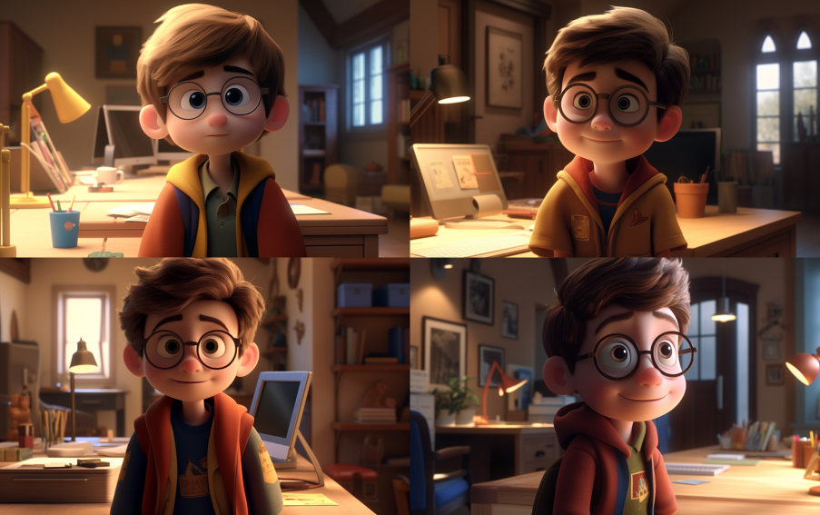
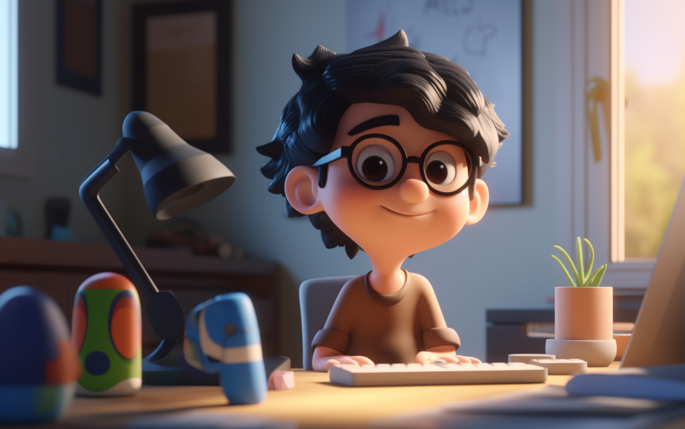
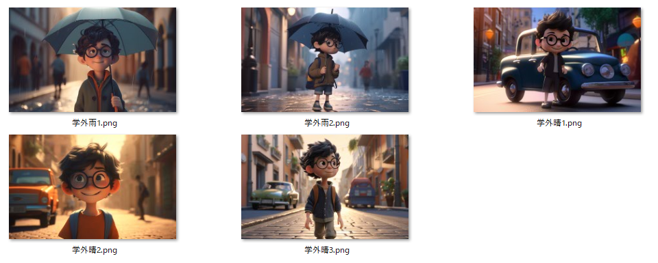
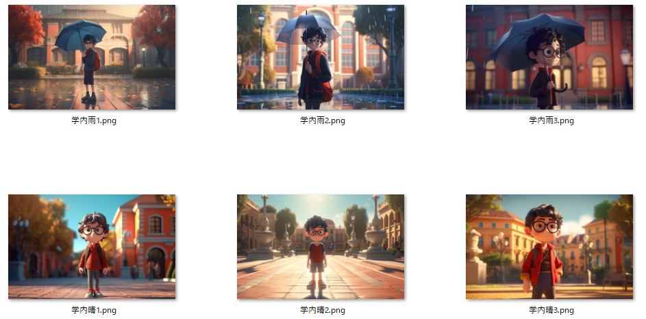
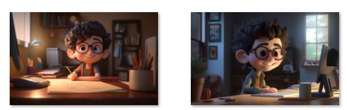
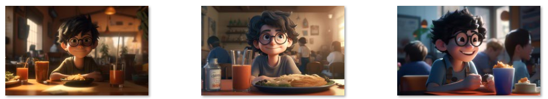
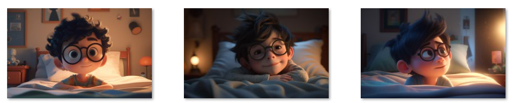
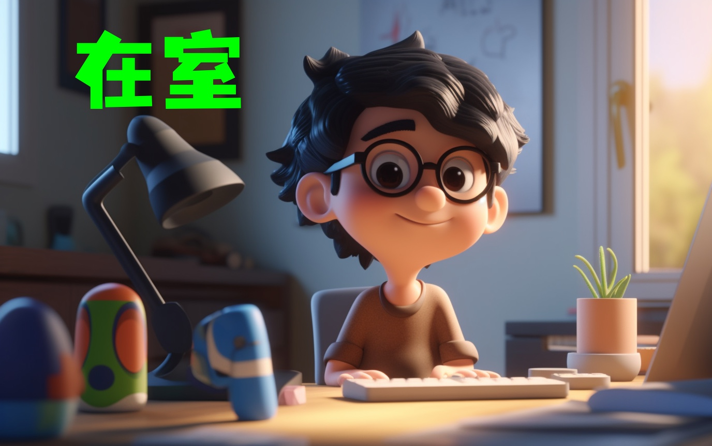

*過去の記事：*  
*[AIアプリケーションに基づいた電子在室表の作成 (1)](https://weils302.com/techblog/status_list_1_20230407/)*

---

アイデアが決まったら、実際に行動に移す必要がある。 次にやるべきことは以下です  
**\*Midjourneyでの画像作成**  
**\*ブラケットの作成**  
**\*コードのテスト**  

この記事では主に画像作成のプロセスについて説明します。

## Midjourneyでの画像作成 
--------------------
<div style="text-align: justify;">
まず、私のアイデアは自分自身を原型としてピクサーの3Dアニメーションスタイルのキャラクターを作り、そのキャラクターを私の状況に応じて
異なる環境に配置することでした。例えば、私が部屋にいるときには、そのキャラクターがデスクに座っている画像を、
学内にいるときにはそのキャラクターが学内を歩いている画像を表示するといった感じです。このアイデアに基づいて、
私はまず自分の写真を使って関連するスタイルの画像を生成しました。
</div>


<p style="font-size: 16px; line-height: 0.6;"><i>(これはホームページの画像から生成したいくつかのバージョンです)</i></p>

<div style="text-align: justify;">
これらの画像は確かに私が求めていたスタイルなので、右上の画像のseedを保持してシーンを変更することにしました。
デスクの前に座っているシーンを何度か試してみたところ、seedから生成される画像は元の画像の構図を保持するようで、
結果としてデスクが背景になってしまいました。これは私が求めていたものではありません。
</div>


<p style="font-size: 16px; line-height: 0.6;"><i>(これらの画像はすべてキャラクターがデスクの前に立っています)</i></p>

<div style="text-align: justify;">
最終的に、私はseedを使った画像生成を断念することにしました。私は「黒髪のカール+メガネ」
という特徴がある程度私の特徴を持ったキャラクターを生成することができると思ったので、これらのキーワードをプロンプトに加えて、
元の画像のseedを置き換えることにしました。最終的に、初めて満足できる画像が誕生しました。
</div>


<p style="font-size: 16px; line-height: 0.6;"><i>(そのプロンプトは以下の通りです：</i></p>

```
a cute boy with wavy short black hair, smiling, sitting in front of a PC, desktop computer, eyeglasses, sunshine from window, 3d art, c4d, octane render, ray tracing, popmart blind box, clay material, Pixar trend --ar 16:10 --v 5 --q 2 --s 750
```
<p style="font-size: 16px; line-height: 0.6;"><i>)</i></p>

<div style="text-align: justify;">
元々の計画では、天候に応じて画像の中のシーンも変わるはずでした。そこで、先程の画像のプロンプトの中の「sunshine」の部分を
「rain outside the window」に変えてみました。しかし、AIは私の意図を理解せず、キャラクターの周りに水滴を追加してしまいました。
この結果は私の期待には合わず、調整が難しそうだったので、一旦諦めることにしました。
</div>


<p style="font-size: 16px; line-height: 0.6;"><i>(新しいプロンプトはうまく機能しませんでした)</i></p>

<div style="text-align: justify;">
「学外」や「学内」の状態は雨のシーンを表現する時にはそんなに難しくなく、一気にいくつかの画像を作りました。
</div>


<p style="font-size: 16px; line-height: 0.6;"><i>(学外)</i></p>


<p style="font-size: 16px; line-height: 0.6;"><i>(学内)</i></p>

<div style="text-align: justify;">
その後も同じ方法で「在室」「食堂」「帰宅」といった他の状態の画像を作りました。
</div>


<p style="font-size: 16px; line-height: 0.6;"><i>(在室)</i></p>


<p style="font-size: 16px; line-height: 0.6;"><i>(食堂)</i></p>


<p style="font-size: 16px; line-height: 0.6;"><i>(帰宅)</i></p>

<div style="text-align: justify;">
結局、背景は私の今の状態を伝えてはいるけれど、一目でわかるような効果にはなっていないと感じた。
そこで「間抜けな方法」—— iPad上のProcreateを使い、これらの画像に現在の状態を示すテキストを加え、画像部分の制作を終えました。
</div>


<p style="font-size: 16px; line-height: 0.6;"><i>(テキストを追加した画像)</i></p>

<div style="text-align: justify;">
私の想像では、もしLofi GirlのようなGIFがあれば最高だと思います。しかし、現状ではAIはGIFの作成にはあまり便利ではないので、
これは将来の計画ということになるでしょう。
</div>

---
*今後の記事：*  
*[AIアプリケーションに基づいた電子在室表の作成 (3)](https://weils302.com/techblog/status_list_3_20230418/)*
