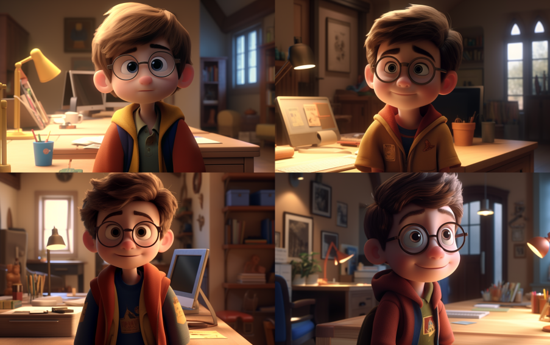
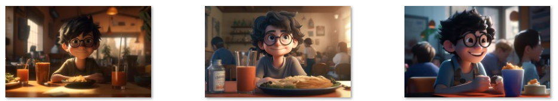

*上一期内容：[基于AI应用的电子在室表制作（一）](https://weils302.com/zh/techblog/status_list_1_20230407/)*

---

思路确定以后就需要开始实际行动起来了。接下来需要做的事情有  
**\*Midjourney制作图片**  
**\*制作支架**  
**\*测试代码**  

这次主要讲一下图片制作的过程。

## Midjourney图片制作 
--------------------
首先我的想法是以我自己为原型制作一个皮克斯3D动画风格的人物，然后根据我的状态让这个人物处在不同的环境当中。
比如我在房间时就在显示器上显示这个卡通人物坐在办公桌前，如果我在校园内就显示这个人物走在校园内的图片。
根据这个想法我首先用我自己的照片生成了相关风格的图片。

<p style="font-size: 16px; line-height: 0.6;"><i>(这就是根据主页上的那张图生成的几个版本)</i></p>

这些图看起来确实是我想要的风格，所以保留右上那张图的seed进行场景的更换。尝试了几波坐在办公桌前的场景后我发现
根据一个seed生成的图片似乎会保留原图的构图，于是出来的结果基本都是办公桌成为了背景，这并不是我想要的。

<p style="font-size: 16px; line-height: 0.6;"><i>(这些图都是人物站在办公桌前)</i></p>

最后我决定放弃用seed生成图片。我觉得“黑色卷发+眼镜”在一定程度上能生成有我的特征的人物，所以我把这些关键词加入prompt来代替
原图的seed。最后，第一张我满意的图片诞生了。

<p style="font-size: 16px; line-height: 0.6;"><i>(其prompt如下：</i></p>

```
a cute boy with wavy short black hair, smiling, sitting in front of a PC, desktop computer, eyeglasses, sunshine from window, 3d art, c4d, octane render, ray tracing, popmart blind box, clay material, Pixar trend --ar 16:10 --v 5 --q 2 --s 750
```
<p style="font-size: 16px; line-height: 0.6;"><i>)</i></p>

原本我的计划是根据不同的天气，图片里的场景也会有变化。所以我又试着把刚才那张图的prompt中阳光的部分改成
“rain outside the window”。但是AI似乎并没有明白我的意思，直接在人物身旁加了一些水滴。这个结果不符合我的预期，
而且似乎难以调整，所以暂时放弃。

<p style="font-size: 16px; line-height: 0.6;"><i>(新的prompt效果并不好)</i></p>

“在校区外”和“在校区内”的状态在表现下雨的场景时就没那么难了，一口气做了好几张。

<p style="font-size: 16px; line-height: 0.6;"><i>(校外)</i></p>


<p style="font-size: 16px; line-height: 0.6;"><i>(校内)</i></p>

之后以同样的方法做出其他“在室”“在食堂”“回家”等状态的图片。

<p style="font-size: 16px; line-height: 0.6;"><i>(在房间内)</i></p>


<p style="font-size: 16px; line-height: 0.6;"><i>(在食堂)</i></p>


<p style="font-size: 16px; line-height: 0.6;"><i>(回家)</i></p>

最后我觉得虽然背景能表达我当前的状态，但是没法做到让人一目了然的效果。所以我用了一个“笨办法”——在iPad上用
Procreate给这些图片加上当前状态的文字，这样图片部分就制作完成了。

<p style="font-size: 16px; line-height: 0.6;"><i>(加上文字后的图片)</i></p>

其实在我想象中如果有类似Lofi Girl那种动图表现是最好的。但是目前AI作图在动图的制作上还不是很方便，
所以这可以算是个将来的计划吧。
