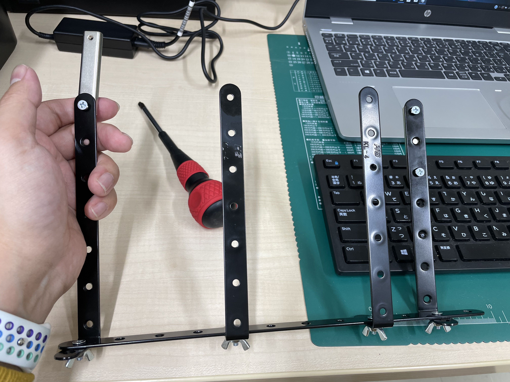
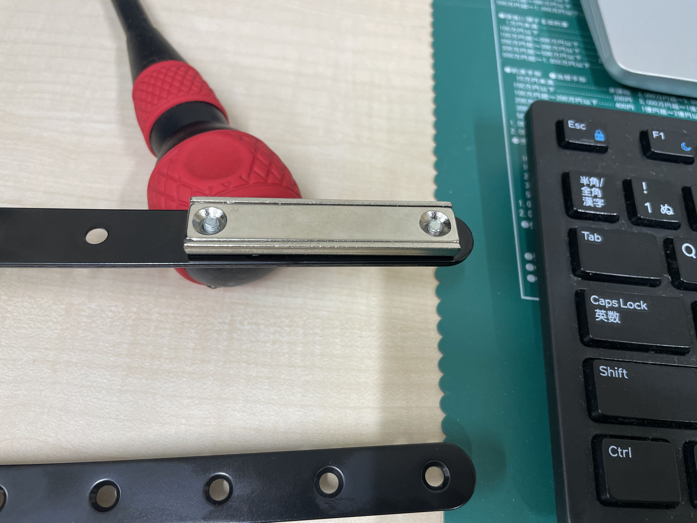
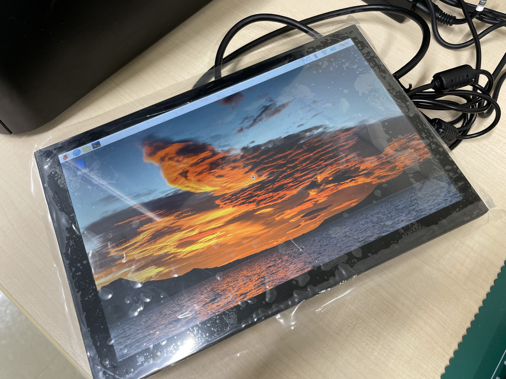
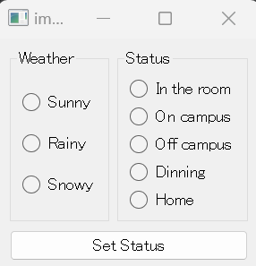

*Previous content:*  
*[Making a Digital Office Door Sign Based on AI Application (Part 1)](https://weils302.com/en/techblog/status_list_1_20230407/)*  
*[Making a Digital Office Door Sign Based on AI Application (Part 2)](https://weils302.com/en/techblog/status_list_2_20230415/)*

---

After obtaining the image resources, what remains is to make the bracket and get the code running.

## Making a Bracket for the Raspberry Pi and the Display
--------------------

While creating the images, I also looked for materials in the nearby HomeCenter that I could use to make the bracket.
With a few metal pieces and screws, I made a bracket that could hold the display.

<i>(Assembled such a bracket)</i>

Next was how to secure the bracket to the door. In my first blog post, I mentioned that since the iron door of the room
cannot be drilled, I considered using magnets. At this point, the strength of the magnet's attraction becomes crucial.
Additionally, I needed magnets with holes, making it convenient for me to use screws to secure the magnet to the bracket
(the bracket has many screw holes). After looking around in HomeCenter, I found that magnets with holes didn't have strong attraction,
suitable only for sticking small notes. In my office, there are some magnetic hooks with strong attraction. However,
these hooks move back and forth, which means when opening and closing the door, the bracket might sway and possibly hit the display,
so they weren't an option. In the end, I searched online and found suitable strong magnets on Amazon.

<i>(One side is secured with just one screw, allowing for free rotation)</i>

<i>(The other side is fully secured)</i>

<i>(Thus, it's attached to the door)</i>
  

## Installation and Setup of the Raspberry Pi
--------------------

Since the back of this display has screw holes that fit the size of the Raspberry Pi, it's easy to secure the Raspberry Pi
to the display. Since the initial boot requires system setup and the installation of some plugins needed for remote control,
I connected a regular mouse and keyboard.

<i>(The Raspberry Pi can be secured to the back of the display)</i>

<i>(Once the power, keyboard, mouse, and display are connected, there are many cables at the back.)</i>

<i>(Successfully booted up, accessed the system, and connected to the room's WiFi.)</i>

After setting up VNC on the Raspberry Pi, I can now directly operate and transfer files from my work desktop.
Using the VNC Viewer on the desktop, I transferred the prepared server code files to the Raspberry Pi,
and after running that code through the built-in terminal, the Raspberry Pi started listening. Afterward,
running the client code on the desktop displays a GUI window. Setting the status in this window displays the image on the Raspberry Pi's display.
To check the current image display status, you can view it in the VNC Viewer. In the current version, when changing the status,
you need to press ESC in the VNC Viewer to exit the image display and then select the next status to display.
This process is a bit cumbersome and can be improved in subsequent version updates.

<i>(Client window, select the current weather on the left and the status on the right. After selecting, click the button, and the image will be displayed.)</i>

<i>(Viewing the image display status in the VNC Viewer)</i>

<i>(Display on the door)</i>

<i>(Overall, the display effect is also good, and it looks very clear.)</i>

For easier version control in the future, I have uploaded the relevant code to a GitHub repository (currently private). I plan to decide later whether to make it public or not.

