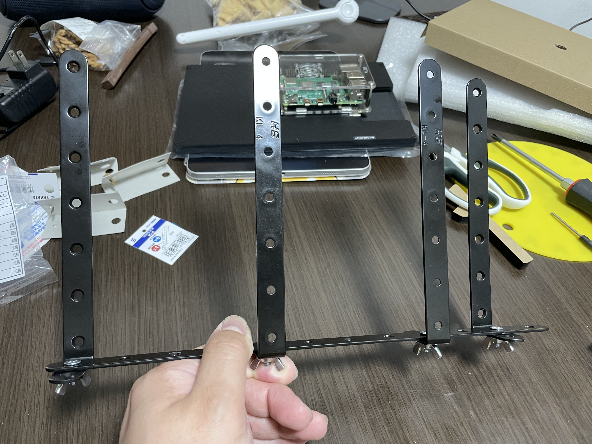
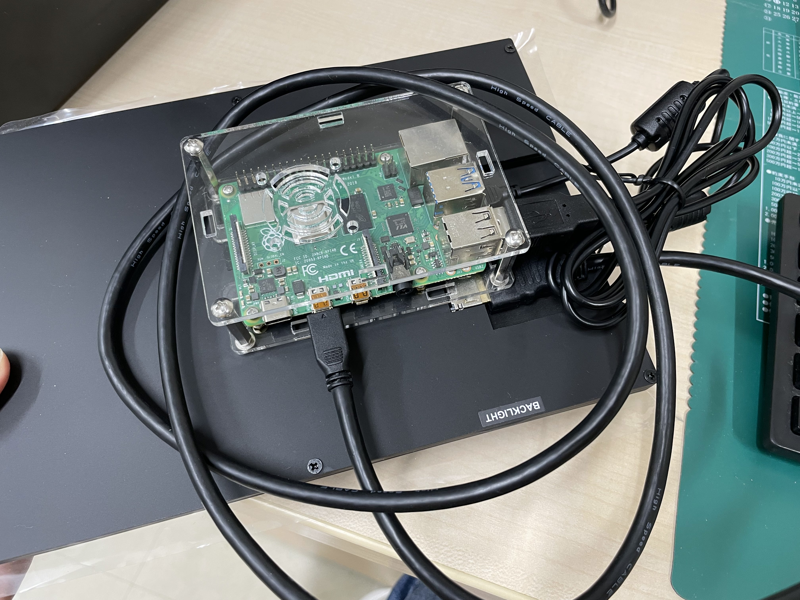
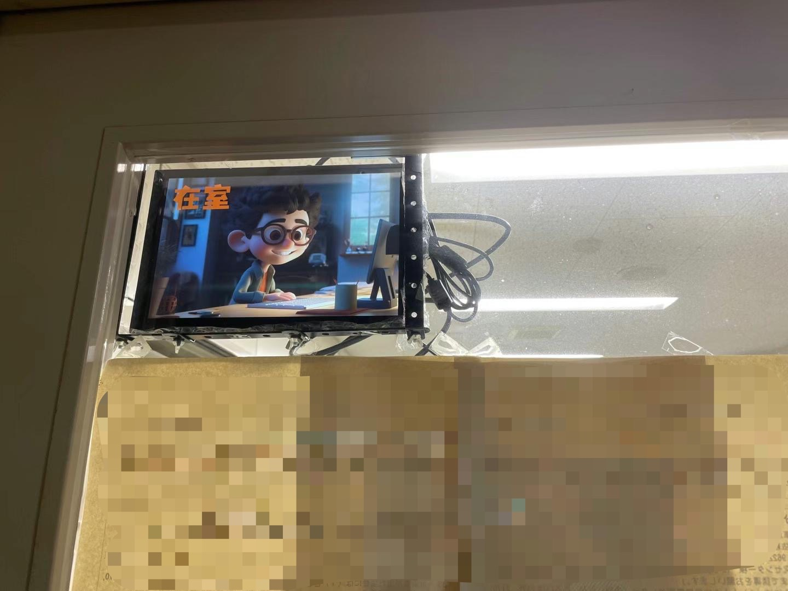

*過去の記事：*  
*[AIアプリケーションに基づいた電子在室表の作成 (1)](https://weils302.com/techblog/status_list_1_20230407/)*  
*[AIアプリケーションに基づいた電子在室表の作成 (2)](https://weils302.com/techblog/status_list_2_20230415/)*

---

画像リソースが手に入った後、次にブラケットを作成し、コードを実際に動かすことです。

## ラズベリーパイとディスプレイ用ブラケットの製作
--------------------

画像を作成する過程で、近くのホームセンターでブラケットを作るための材料を探していました。いくつかの鉄片とネジを使って、ディスプレイを固定するブラケットを簡単に作成しました。

<i>(このようなブラケットを組み立てました)</i>

次に、ブラケットをドアにどのように固定することです。最初の記事で、鉄製のドアに穴を開けることができないため、磁石を使用することを考えていると言及しました。
この時、磁石の吸引力がどれほど強いかが非常に重要です。さらに、磁石には穴が開いている必要があり、それによって磁石をブラケットに固定するためのネジを使用します
（ブラケットには多くのネジ穴があります）。ホームセンターを見て回ったところ、穴が開いている磁石の吸引力はそれほど強くなく、
小さなメモを貼るのに適しているだけでした。私のオフィス部屋には強力な磁石のフックがありますが、これらのフックは前後に動くので、
ドアを開け閉めするときにブラケットが前後に揺れて、ディスプレイに当たる可能性があるため使用できません。最終的に、インターネットで探し、
Amazonで適切な強力な磁石を見つけました。

<i>(一方はネジを1つだけ締めて、自由に回転できます)</i>

<i>(もう一方はしっかり固定)</i>

<i>(このようにしてドアに固定しました)</i>
  

## ラズベリーパイの取り付けと設定
--------------------

このディスプレイの背面にはラズベリーパイのサイズに合ったネジ穴があるので、ラズベリーパイをディスプレイに簡単に固定することができます。
初回起動時にはシステムの設定が必要で、リモートコントロールのためのプラグインなどをインストールする必要があるため、通常のマウスとキーボードを接続しました。

<i>(ラズベリーパイはディスプレイの背面に固定できます)</i>

<i>(電源、キーボード、マウス、ディスプレイを接続すると、背面にはたくさんのケーブルがあります。)</i>

<i>(無事に起動して、システムにアクセスし、部屋のWiFiに接続しました。)</i>

ラズベリーパイにVNCを設定した後、仕事用のデスクトップから直接操作やファイル転送が可能になりました。デスクトップのVNC Viewerを使用して、
準備したサーバーコードファイルをラズベリーパイに転送し、システムの組み込みターミナルでそのコードを実行すると、ラズベリーパイはリスニングを開始します。
その後、デスクトップでクライアントコードを実行すると、GUIウィンドウが表示され、そのウィンドウで状態を設定すると、
画像がラズベリーパイのディスプレイに表示されます。現在の画像表示状態を確認するには、VNC Viewerで確認できます。現在のバージョンでは、状態を変更する際に、
VNC ViewerでESCキーを押して画像表示を終了し、次の状態を選択して表示する必要があります。このプロセスは少し煩雑で、
次のバージョンアップデートで改善することを考えています。

<i>(クライアントウィンドウ、左側で現在の天気を選択し、右側で状態を選択。選択後、ボタンをクリックすると画像が表示されます。)</i>

<i>(VNC Viewerで画像表示状態を確認)</i>

<i>(ドア上の表示)</i>

<i>(全体的にディスプレイの表示も良好で、非常にクリアに見えます)</i>

今後のバージョン管理のために、関連コードをGitHubリポジトリにアップロードしました（現在はプライベートリポジトリ）。後で状況に応じて公開するかどうかを決定する予定です。

