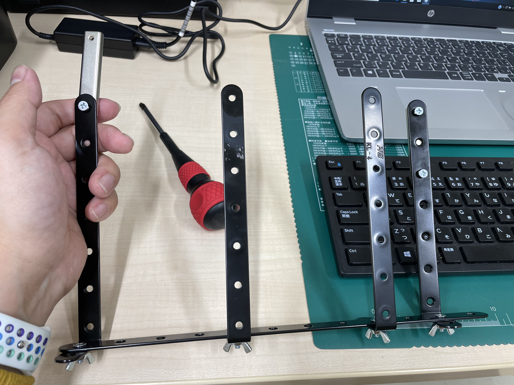
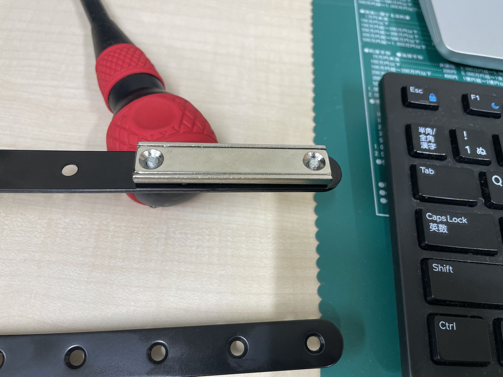
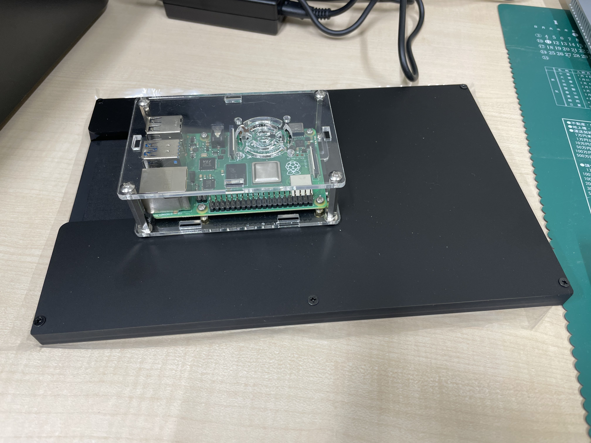
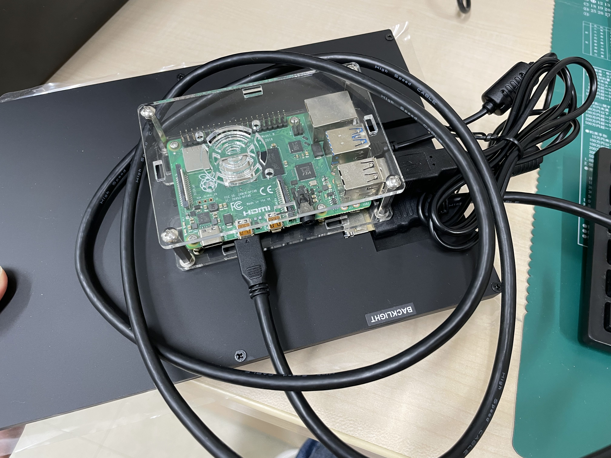
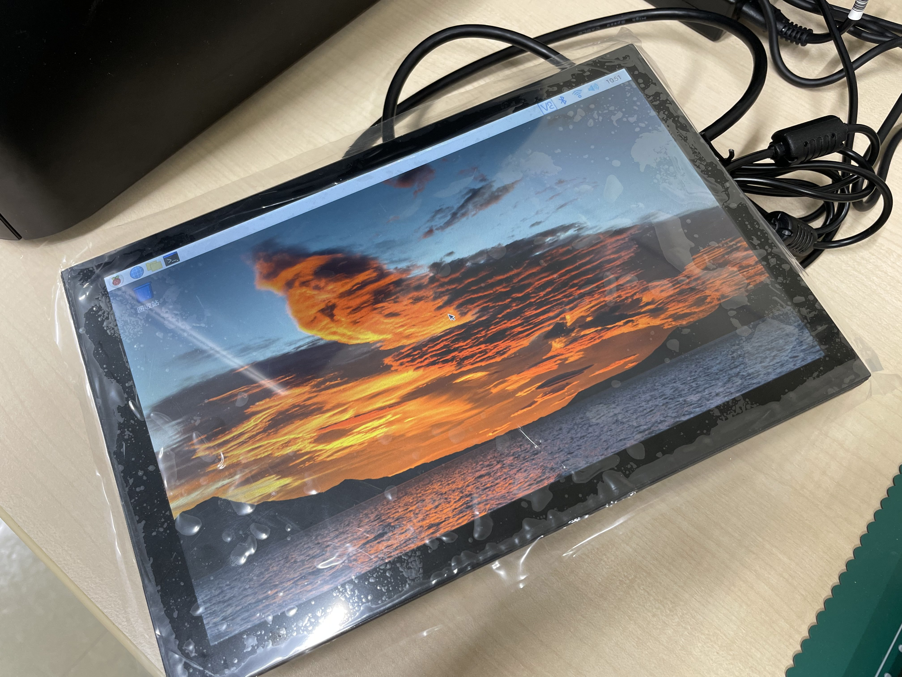
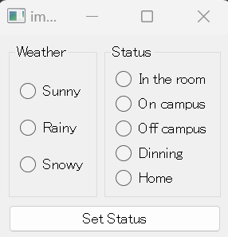
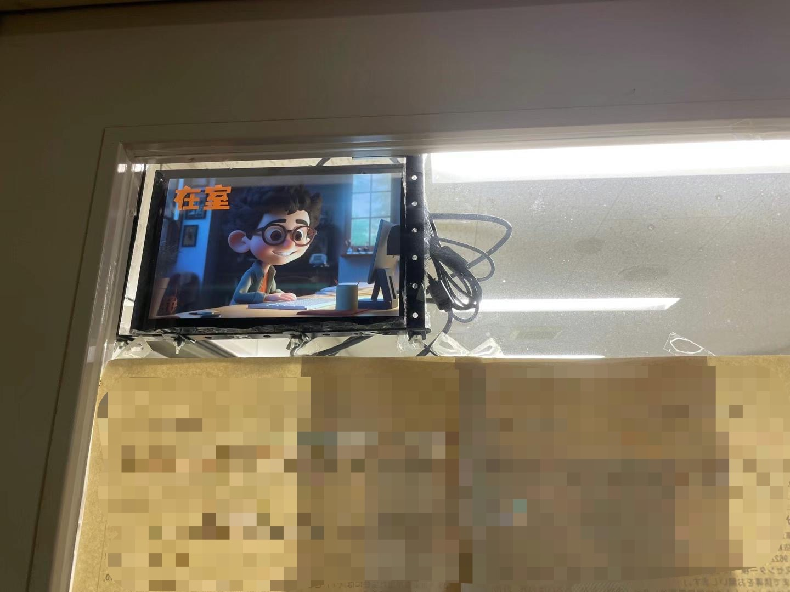
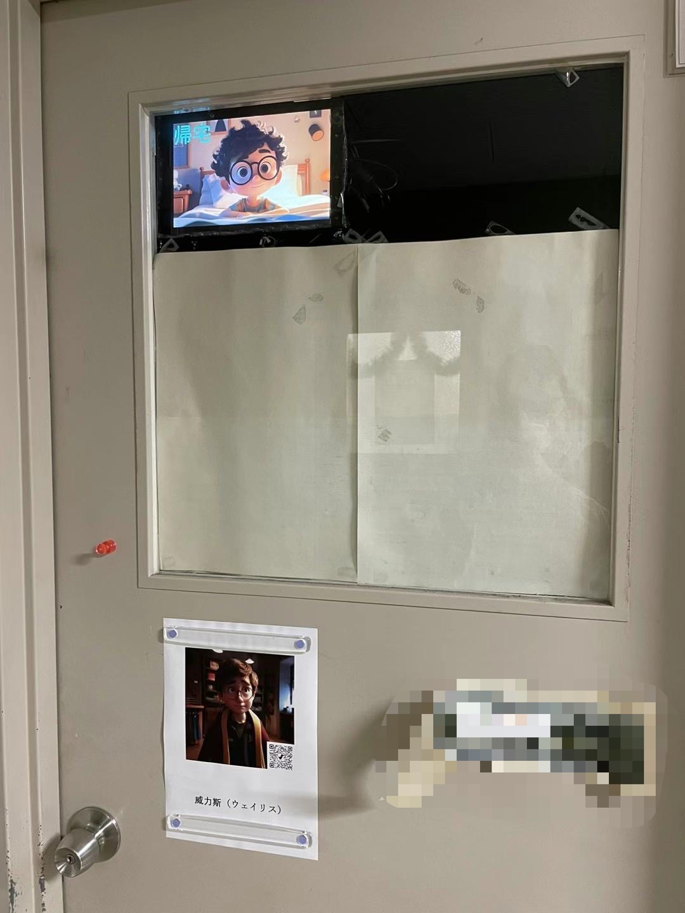

*往期内容：*  
*[基于AI应用的电子在室表制作（一）](https://weils302.com/zh/techblog/status_list_1_20230407/)*  
*[基于AI应用的电子在室表制作（二）](https://weils302.com/zh/techblog/status_list_2_20230415/)*

---

有了图片资源之后，剩下的就是做支架并让代码实际运行起来。

## 给树莓派和显示器制作支架 
--------------------

在制作图片的过程中我也留意了一下附近的HomeCenter中我可以用来做支架的材料。几个铁片加上几个螺丝就搞定了能把显示器兜住的支架。

<i>(拼出来这样的一副支架)</i>

之后是怎样把支架固定到门上。在第一篇博客中我也提到过由于房间的铁门不能打洞，所以我考虑用磁铁。此时磁铁的吸力如何就很重要了。此外我需要磁贴上有洞，
方便我用螺丝把磁铁固定在架子上（架子上可以拧螺丝的洞挺多）。我在HomeCenter转了一圈发现有洞的磁铁吸力很一般，只适合办公室场景下贴小纸条用。
我的办公室有一些磁吸的挂钩，吸力也很强。但是这些挂钩的钩子部分是会前后移动的，在门上使用的话开关门时会让支架整体前后摇摆，可能会磕到显示器，所以不能用。
最后我在网上找了找，在Amazon上找到了合适的大吸力磁铁。

<i>(一侧只拧一个螺丝，可自由旋转)</i>

<i>(另一侧完全固定住)</i>

<i>(这样就固定在门上了)</i>
  

## 树莓派的安装和设置
--------------------

由于这个显示器背面有适合树莓派尺寸的螺丝孔，所以能很方便地把树莓派固定在显示器上。由于第一次开机需要对系统进行设置，并且需要安装一些远程控制需要的插件等，所以连接了普通的鼠标键盘。

<i>(树莓派能被固定在显示器背面)</i>

<i>(把电源，键盘，鼠标，显示器接上以后后面就都是线。)</i>

<i>(成功开机进入系统并连接上房间的WiFi。)</i>

在树莓派上设置好VNC之后可以直接从工作用的台式机进行操作并传送文件了。通过台式机的VNC Viewer把准备好的服务器代码文件传到树莓派，然后通过系统自带的terminal
运行该代码之后树莓派就开始监听了。之后回到台式机运行客户端的代码会显示一个GUI窗口，在该窗口进行状态的设置图片就会显示在树莓派的显示器上。如需确认
目前的图片显示状况，从VNC Viewer即可查看。目前版本在更换状态时需要在VNC Viewer中按ESC退出图片显示，然后再选择下一个状态进行显示。这一过程
略繁琐，可以在后续版本更新中改善。

<i>(客户端窗口，左侧选择目前的天气，右侧选择状态，选好点击按钮图片就会显示。)</i>

<i>(在VNC Viewer中查看图片显示情况)</i>

<i>(在门上的效果)</i>

<i>(整体来讲显示器效果也不错，看着很清楚)</i>

为了方便后续版本控制，目前已将相关代码上传至GitHub仓库（目前为私人仓库），打算之后根据情况再决定是否设置为公开。
