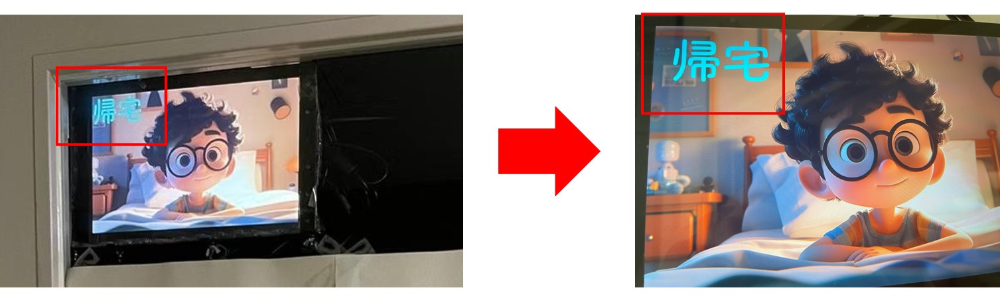

### V2.0.0: Added a service stop button and implemented an automatic image switching feature （2023.5.10）
---

Previously, changing the status required accessing VNC Viewer, pressing ESC to exit the image display, then selecting a new status. 
This process was somewhat cumbersome, so in this version, it has been changed to automatically switch images by clicking the 
"Set Status" button. This function will disable the ESC key, preventing control of the Raspberry Pi via VNC Viewer. 
To address this, some code logic has been revised, and a service stop button has been added. 
The functionality of the service stop button is equivalent to that of the ESC key in previous versions.

V2.0.0 client window, with the addition of the "Shutdown Server" button.

### V1.1.0: Added "Lecture" status, fixed display issues (2023.4.25)  
---

As "Lecture" is a frequently used status, a corresponding option has been added. Moreover, in the previous version, 
images appeared to be automatically enlarged, leading to the edges of the images not being displayed. 
This issue has been resolved in this update.

One of the images for the "Lecture" status

V1.1.0 client window, with the addition of the "Lecture" option.

Fixed the issue of image edges being cropped.

### V1.0.0: Product officially put into use (2023.4.20)
---

The first version has been deployed. It allows users to select and set their in-room status for different weather conditions
(as it is currently spring, the snowy weather feature is not available). The status can be set through the steps of "selecting → clicking the set status button."
To set the next status, one needs to press ESC in VNC Viewer to exit the image display before setting the status.

V1.0.0 client window.

