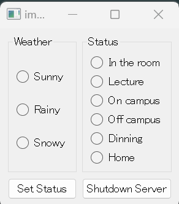
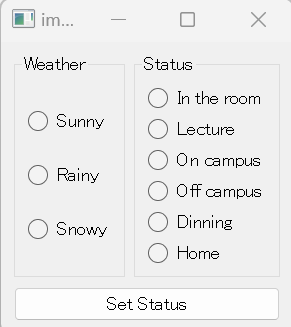
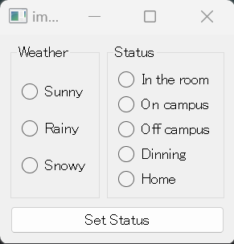

### V2.0.0: サービス停止ボタンを追加し、自動画像切替機能を実装（2023.5.10）
---

以前、ステータスを変更するには、VNC Viewerにアクセスし、ESCを押して画像表示を終了し、新しいステータスを選択する必要がありました。
このプロセスはやや煩雑であったため、このバージョンでは「Set Status」ボタンをクリックすると画像が自動的に切り替わるように変更されました。
この機能はESCキーを無効にし、VNC Viewerを介してRaspberry Piを制御することを防ぎます。これを解決するために、一部のコードロジックが改訂され、
サービス停止ボタンが追加されました。サービス停止ボタンの機能は、以前のバージョンのESCキーに相当します。

V2.0.0クライアントウィンドウ、「サーバーを停止する」ボタンを追加。

### V1.1.0: 「講義」ステータスを追加し、表示問題を修正（2023.4.25）
---

「講義」はよく使用されるステータスであるため、対応するオプションが追加されました。さらに、前のバージョンでは、画像が自動的に拡大され、
画像の端が表示されないという問題がありました。この更新でこの問題が解決されました。

「講義」ステータスの画像の一つ

V1.1.0クライアントウィンドウ、「講義」オプションを追加。

画像の端が切り取られる問題を修正しました。

### V1.0.0: 製品の正式稼働開始（2023.4.20）
---

最初のバージョンが稼働開始しました。異なる天候状況に応じて室内状態を選択し設定できます（現在は春なので、雪の天候機能は現在使用できません）。
状態は「選択 → 設定ボタンをクリック」の手順で設定します。次の状態を設定する際には、VNC ViewerでESCを押して画像表示を終了した後、状態の設定を行う必要があります。

V1.0.0クライアントウィンドウ。

