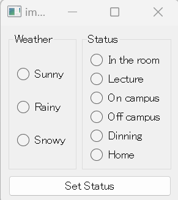

### V2.0.0 添加服务停止按钮并实现自动换图功能 （2023.5.10）
---

此前更换状态时需要进入VNC Viewer按ESC退出图片显示后再选择新的状态。由于这个过程略繁琐，所以在此版本中将其更改为点击"Set Status"按钮自动换图。
此功能会使ESC键失效，以至于不能通过VNC Viewer控制树莓派。针对这个问题更改了部分代码逻辑并添加了服务停止按钮。服务停止按钮的功能相当于此前版本的
ESC键。

V2.0.0客户端窗口，增加了“停止服务”按钮

### V1.1.0 添加“上课”状态，修复画面问题 （2023.4.25）
---

由于“上课”是个常用状态，所以添加了对应选项。此外在上一版本中图像貌似会被自动放大，最终导致图像边缘的内容不能被显示。此次更新修复了此问题。

“上课”状态的图像之一

V1.1.0客户端窗口，增加了“上课”选项

修复了图像边缘被裁切的问题

### V1.0.0 产品正式投入使用（2023.4.20）
---

首个版本投入使用。可选择并设置在不同天气情况下的在室状态（因为现在是春天，所以雪天功能目前不可用）。通过“选择→点击设置按钮”的步骤来设定状态。
设置下一个状态时，需要在VNC Viewer中按ESC退出图片显示后再进行状态设定。

V1.0.0客户端窗口

