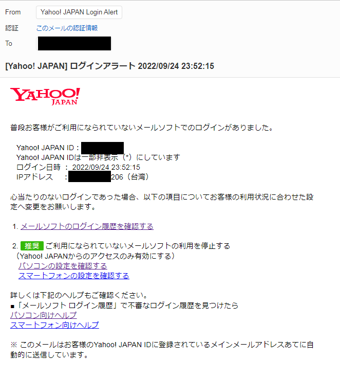

While modifying the code for this website in the middle of the night, I suddenly received an email notification stating that there was a suspicious login record from Taiwan.

At first, I was quite puzzled because login requires verification codes. How did this suspicious login bypass the verification codes? Then I suspected it might be a phishing email, so I checked the header information.

From the IP in the header information, this email was indeed sent by Yahoo. After checking the link address in the email, I could confirm that this is an official email from Yahoo.

Then I continued to check the recent login records. Besides the American IPs of some email management forwarding software, there was only one IP record from Taiwan.

Only after querying the location of this IP did I remember that I used a VPN in Taiwan to watch Disney+ on my mobile phone in the evening. However, due to the notch on the iPhone, the VPN indicator won't show in standby mode, so I forgot to disconnect it and started doing other things...-_-|

So, this was purely a farce. It's all the fault of the big notch on the iPhone, Humph!
