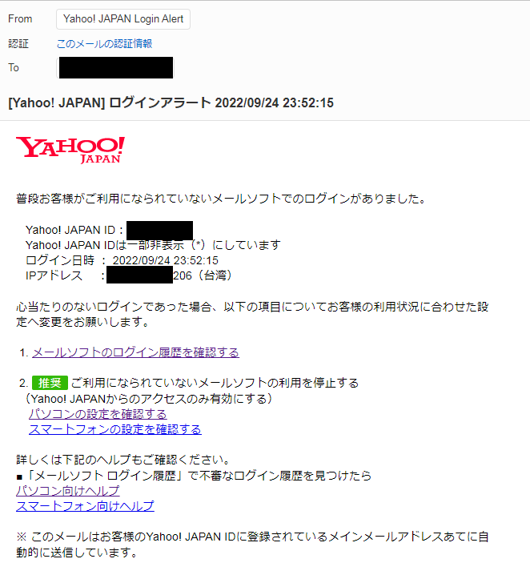
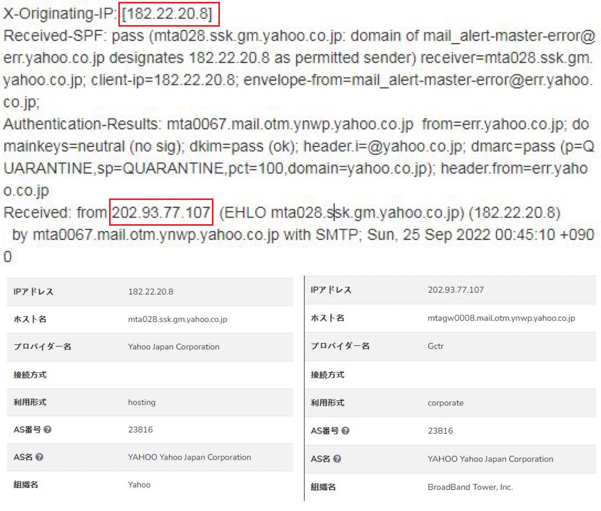
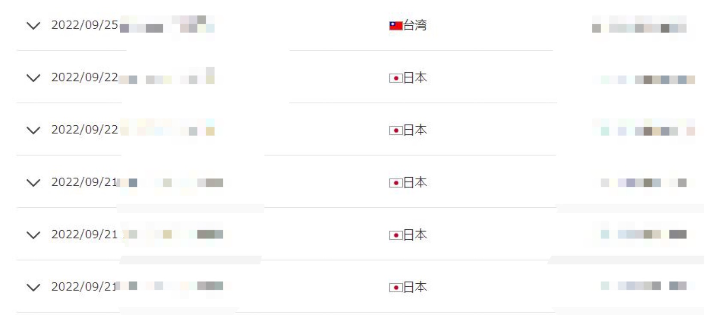

真夜中にこのウェブサイトのコードを修正していると、突然メールが飛び込んできました。台湾からの疑わしいログイン記録が検出されたという通知がありました。

最初は非常に困惑しました。なぜなら、ログインには確認コードが必要なのに、この疑わしいログインはどのようにして確認コードをバイパスしたのでしょうか？それからフィッシングメールではないかと疑い、ヘッダー情報をチェックしました。

ヘッダー情報のIPを見ると、このメールは確かにYahooから送られたものでした。メール中のリンクアドレスを確認すると、これがYahooの公式メールであることを確認できました。

その後、最近のログイン記録を続けて確認しました。メール管理転送ソフトウェアの米国IPの他に、台湾のIP記録が1件だけありました。

このIPの所在地を検索した後で、夜にディズニープラスを観るために台湾のVPNを使っていたことを思い出しました。しかし、iPhoneのノッチのせいで、スタンバイモードではVPNのインジケーターが表示されず、それを切断するのを忘れて他の作業を始めてしまいました...-_-|

だから、これは純粋なドタバタ事件でした。iPhoneの大きなノッチが本当に邪魔だ！
