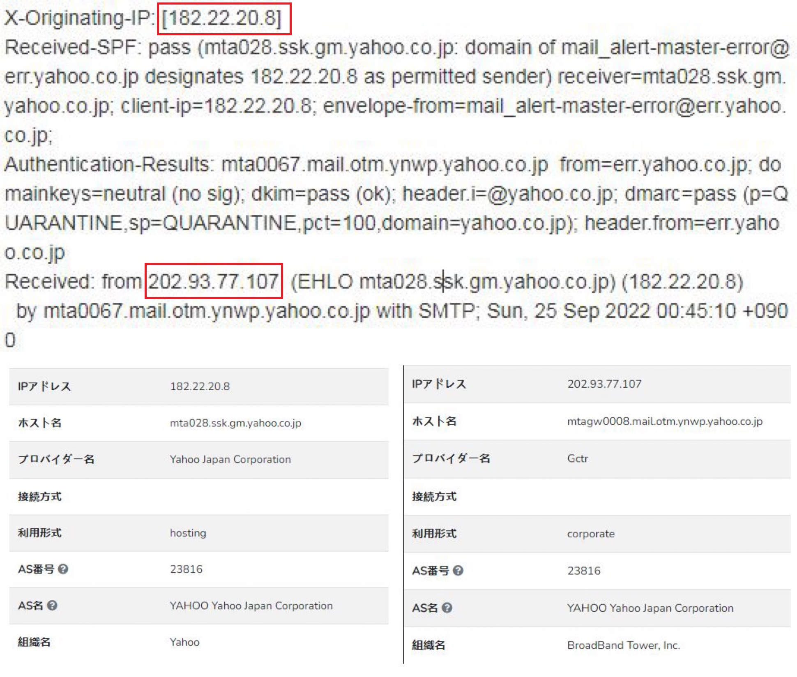

半夜修改本网站的代码时突然蹦出一条邮件提示说侦测到在台湾的可疑登录记录。

一开始比较纳闷，因为登录需要验证码，这次的可疑登录是怎么绕过验证码的？后来怀疑会不会是钓鱼邮件，所以检查了一下头信息。

从头信息的IP来看这个邮件确实是Yahoo发出来的，看了下邮件中的链接地址，也能确认这是一封
Yahoo官方的邮件。

然后继续察看近期登录记录， 发现除了一些邮件管理转发软件的美国IP之外只有一次台湾的IP记录。

最后查询过这个IP的属地之后才想起来晚上为了用手机看Disney+挂过台湾的VPN，但是因为Iphone的刘海
待机状态下VPN标志是不会显示的，以至于我后来忘了断开就开始干别的事情了...-_-|

所以，这纯粹就是一回乌龙事件。都怪Iphone的大刘海，哼！
